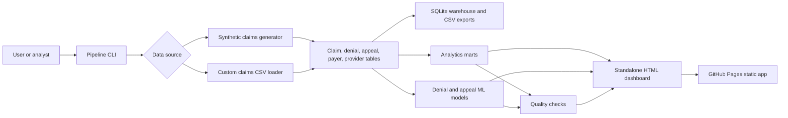
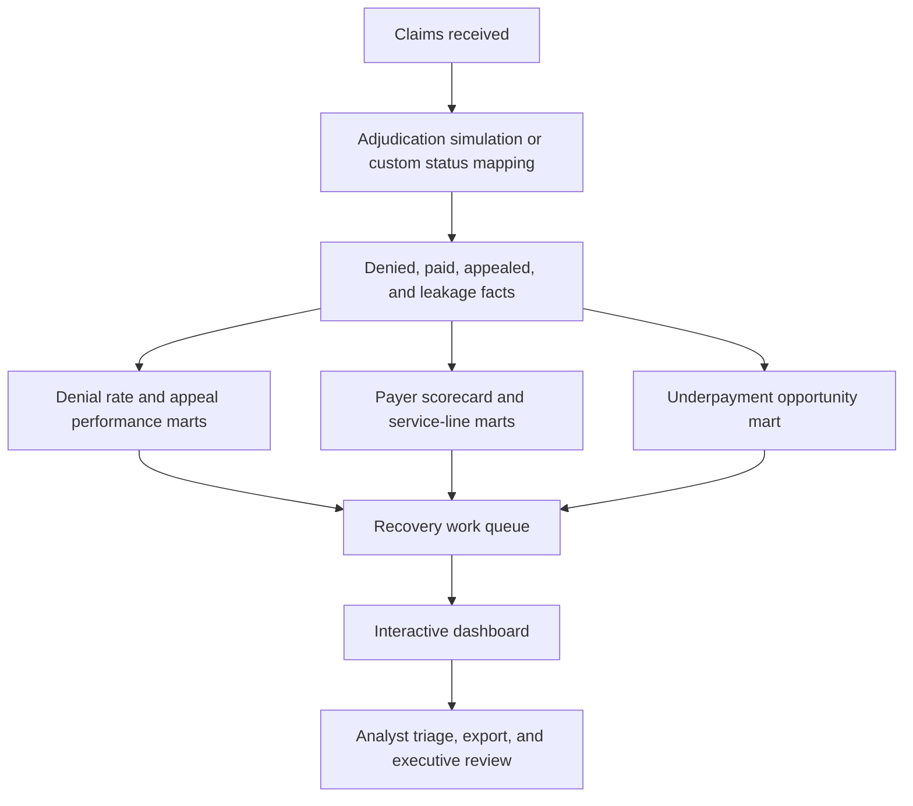

# Claims Denials Revenue Cycle Analytics
### Turning denial operations into an interactive recovery intelligence platform

Claims Denials Revenue Cycle Analytics is a production-ready healthcare analytics project for denial prevention, appeal prioritization, payer friction analysis, underpayment discovery, and executive revenue cycle reporting.

[Live GitHub Pages App](https://mohammed-ghanim-siddiqui.github.io/claims-denials-revenue-cycle-analytics/) | [GitHub Repository](https://github.com/MOHAMMED-GHANIM-SIDDIQUI/claims-denials-revenue-cycle-analytics) | [Deployment Workflow](https://github.com/MOHAMMED-GHANIM-SIDDIQUI/claims-denials-revenue-cycle-analytics/actions/workflows/deploy-pages.yml)


---

## About This Repository

This repository contains a complete claims denials, appeals, and revenue cycle analytics system. It builds a governed analytics warehouse, trains scoring models, generates decision-ready marts, and publishes a standalone interactive dashboard that can run locally or on GitHub Pages for free.

The goal is not only to show charts. The goal is to simulate a real enterprise analytics workflow for:

- denial trend analysis
- appeal recovery prioritization
- payer and plan friction monitoring
- service-line denial benchmarking
- underpayment opportunity detection
- work queue triage
- custom claims CSV ingestion
- executive reporting and documentation
- deployment-ready portfolio presentation

The app is designed as a polished revenue cycle command center: fast to scan, easy to filter, useful for operators, and credible enough for portfolio, healthcare analytics, and BI storytelling.

---

## Important Data Note

Claim-level records generated by this repository are synthetic. They are created from transparent business rules and benchmark-style denial assumptions for analytics demonstration.

They are not real patient, provider, payer, or adjudication records.

If you use custom data, do not upload protected health information, member identifiers, patient names, or confidential payer/provider data to a public repository.

---

## What You Will Find Here

This project includes:

- a complete Python revenue cycle analytics pipeline
- synthetic claims, denials, appeals, contract, provider, payer, and leakage data
- custom CSV ingestion with flexible healthcare column aliases
- SQLite warehouse creation
- governed CSV mart exports
- denial risk scoring and appeal success scoring
- data-quality checks with pass/fail governance
- standalone glassmorphic dashboard
- search, filters, sorting, modal details, local triage state, and CSV export
- GitHub Pages deployment workflow
- dashboard build automation
- tests for generated and custom data paths
- KPI dictionary, data dictionary, model cards, dashboard spec, and executive summary
- original healthcare analytics blueprint PDFs and HTML exports

---

## Live Product

| Resource | Link |
|---|---|
| Live app | https://mohammed-ghanim-siddiqui.github.io/claims-denials-revenue-cycle-analytics/ |
| Repository | https://github.com/MOHAMMED-GHANIM-SIDDIQUI/claims-denials-revenue-cycle-analytics |
| Deployment workflow | https://github.com/MOHAMMED-GHANIM-SIDDIQUI/claims-denials-revenue-cycle-analytics/actions/workflows/deploy-pages.yml |
| Custom data guide | [docs/custom_data_guide.md](docs/custom_data_guide.md) |
| GitHub publication checklist | [docs/github_publication_checklist.md](docs/github_publication_checklist.md) |

---

## Product Index

Jump to a core area:

[Dashboard](#dashboard) . [Work Queue](#denial-work-queue) . [Custom Data](#custom-data-support) . [Architecture](#architecture) . [Testing](#quality-assurance) . [Deployment](#deployment) . [Roadmap](#roadmap)

---

## What This Platform Solves

| Revenue cycle problem | Product response |
|---|---|
| Denials are spread across payers, plans, reasons, and service lines | Governed marts consolidate denial patterns into one analytics layer |
| Appeal teams need to know what to work first | Work queue ranks open denials by expected recovery value and priority |
| Payer behavior is hard to compare | Payer scorecard highlights denial rate, appeal friction, recovery, and underpayment signals |
| Underpayments hide inside paid claims | Contract-rate comparison surfaces recovery opportunities |
| Leaders need concise financial storytelling | Executive summary and dashboard KPIs turn operational detail into decision context |
| Data quality can break trust | Quality checks validate claim counts, table integrity, model outputs, and mart readiness |
| Public demos often stay static | Dashboard supports search, filters, sorting, triage actions, local state, and CSV exports |
| Users may want to test their own data | Custom CSV loader accepts flexible payer, claim, payment, denial, and appeal fields |

---

## Feature Index

| Area | Features |
|---|---|
| Claims pipeline | Synthetic generation, custom CSV loading, deterministic seeds, configurable claim volume |
| Warehouse | SQLite database, dimension tables, fact tables, exported CSVs |
| Denials analytics | Denial rate, denied amount, preventable denials, reason mix, service-line trends |
| Appeals analytics | Appeal filing, success rate, recovered amount, appeal decision timing |
| Revenue leakage | Recoverable amount, expected recovery value, unrecovered opportunity |
| Work queue | Priority tiers, recommended actions, search, filters, row detail modal |
| Underpayments | Expected versus paid comparison, opportunity ranking, export-ready table |
| Payer intelligence | Friction score, underpayment rate, documentation share, appeal outcomes |
| Machine learning | Denial risk model, appeal success model, score exports, model card |
| Governance | Quality report, simulation methodology, KPI dictionary, data dictionary |
| UI | Premium dashboard, dark and light mode, glassmorphism, responsive layout |
| Deployment | Static site build, GitHub Actions, GitHub Pages hosting |

---

## Application Views

### Dashboard

The executive command center for the revenue cycle portfolio.

- total claims
- denial rate
- denied amount
- expected recovery
- appeal performance
- model and quality indicators
- trend and payer visualizations
- dark and light theme toggle

### Denial Work Queue

The operational view for recovery action.

- searchable denial queue
- payer, service line, and denial reason filters
- sortable table columns
- priority tiers
- recommended next action
- claim detail modal
- flag, resolve, and reopen actions
- browser-local triage state
- CSV export

### Payer And Service-Line Intelligence

The contract and operational monitoring layer.

- payer scorecards
- friction tiers
- service-line denial trends
- denial reason concentration
- documentation denial share
- appeal upheld rate
- underpayment rate

### Underpayment Opportunities

The leakage discovery view.

- expected payment versus paid amount
- underpaid amount
- payer and service filters
- sorted opportunity table
- CSV export for follow-up analysis

### Governance

The trust layer for analytics delivery.

- quality checks
- model metrics
- simulation disclaimer
- data dictionary
- KPI definitions
- model cards
- dashboard specification

---

## Repository Structure

The codebase separates data generation, analytics logic, reporting, deployment, and documentation so each layer can evolve cleanly.

```text
claims-denials-revenue-cycle-analytics/
|
|-- README.md
|-- requirements.txt
|-- pyproject.toml
|
|-- src/
|   |-- revenue_cycle_analytics/
|       |-- config.py
|       |-- custom_data.py
|       |-- data_generation.py
|       |-- documentation.py
|       |-- marts.py
|       |-- models.py
|       |-- pipeline.py
|       |-- quality.py
|       |-- reporting.py
|       |-- warehouse.py
|
|-- scripts/
|   |-- run_claims_denials_pipeline.py
|   |-- serve_dashboard.py
|   |-- build_static_site.py
|   |-- render_blueprints_to_pdf.mjs
|
|-- tests/
|   |-- test_pipeline.py
|
|-- sql/
|   |-- 05_marts/
|       |-- claims_denials_marts.sql
|
|-- docs/
|   |-- custom_data_guide.md
|   |-- dashboard_spec.md
|   |-- data_dictionary.md
|   |-- data_sources.md
|   |-- github_publication_checklist.md
|   |-- kpi_dictionary.md
|   |-- model_cards.md
|   |-- simulation_methodology.md
|
|-- data/
|   |-- raw/
|       |-- custom_claims_template.csv
|
|-- reports/
|   |-- pdf/
|
|-- .github/
|   |-- workflows/
|       |-- deploy-pages.yml
```

Generated local outputs are intentionally ignored by Git:

```text
data/processed/
reports/dashboard/
reports/figures/
dist/
*.db
```

---

## Architecture



---

## Analytics Flow



---

## Product Design Approach

### 1. Start With Recoverable Value

The dashboard prioritizes financial impact and next-best action, not chart volume.

### 2. Keep Operators Close To The Claim

Queue rows include payer, provider, service line, denial reason, age, recovery estimate, and recommended action.

### 3. Make Executive Review Fast

KPIs, payer scorecards, and service-line summaries are designed for quick leadership readouts.

### 4. Separate Simulation From Governance

The README, dashboard, and docs clearly mark synthetic data boundaries and provide a custom-data path.

### 5. Keep The App Deployment Friendly

The final dashboard is a static HTML artifact, so it can run on GitHub Pages without a paid backend.

---

## Tech Stack

| Layer | Tools |
|---|---|
| Core language | Python 3.11+ |
| Data processing | pandas, NumPy |
| Machine learning | scikit-learn |
| Visual analytics | Plotly |
| HTML rendering | Jinja2 |
| Warehouse | SQLite |
| Dashboard | Standalone HTML, CSS, JavaScript |
| Local state | Browser localStorage |
| Testing | pytest |
| CI/CD | GitHub Actions |
| Free hosting | GitHub Pages |

---

## Getting Started

### 1. Clone The Repository

```powershell
git clone https://github.com/MOHAMMED-GHANIM-SIDDIQUI/claims-denials-revenue-cycle-analytics.git
cd claims-denials-revenue-cycle-analytics
```

### 2. Create A Python Environment

Windows:

```powershell
python -m venv .venv
.\.venv\Scripts\Activate.ps1
pip install -r requirements.txt
```

macOS or Linux:

```bash
python -m venv .venv
source .venv/bin/activate
pip install -r requirements.txt
```

### 3. Build The Analytics Project

```powershell
python scripts\run_claims_denials_pipeline.py
```

Default build output:

```text
12,000 synthetic claims
1,972 denials
787 appeals
20 exported warehouse and mart tables
0 quality failures
```

### 4. Serve The Dashboard Locally

```powershell
python scripts\serve_dashboard.py
```

Open:

```text
http://127.0.0.1:8055/reports/dashboard/claims_denials_revenue_cycle_dashboard.html
```

The dashboard is also standalone and can be opened directly from:

```text
reports/dashboard/claims_denials_revenue_cycle_dashboard.html
```

---

## Useful Commands

Build a larger synthetic dataset:

```powershell
python scripts\run_claims_denials_pipeline.py --claims 20000 --seed 42
```

Allow quality failures during exploration:

```powershell
python scripts\run_claims_denials_pipeline.py --claims 5000 --allow-quality-failures
```

Build from custom claims:

```powershell
python scripts\run_claims_denials_pipeline.py --custom-claims data\raw\custom_claims_template.csv
```

Build a static deploy artifact:

```powershell
python scripts\build_static_site.py
```

Run tests:

```powershell
python -m pytest
```

---

## Custom Data Support

You can rebuild the same dashboard from your own claims CSV:

```powershell
python scripts\run_claims_denials_pipeline.py --custom-claims path\to\your_claims.csv
python scripts\serve_dashboard.py
```

Recommended minimum columns:

```text
claim_id,payer,plan_name,provider_name,service_line,claim_status,denial_reason,submitted_amount,expected_payment_amount,paid_amount,claim_received_date,adjudication_date
```

The importer accepts flexible aliases, including:

| Canonical field | Accepted aliases |
|---|---|
| `claim_id` | `claim_number`, `claim`, `claim_no` |
| `issuer_name` | `payer`, `payer_name`, `insurer`, `carrier` |
| `plan_name` | `plan`, `insurance_plan` |
| `provider_name` | `provider`, `facility`, `billing_provider` |
| `service_line` | `service`, `department`, `specialty` |
| `claim_status` | `status`, `adjudication_status` |
| `denial_reason_category` | `denial_reason`, `denial_category`, `reason`, `denial_code` |
| `submitted_amount` | `billed_amount`, `charge_amount`, `claims_amount` |
| `paid_amount` | `paid`, `payment_amount`, `reimbursed_amount` |
| `claim_received_date` | `received_date`, `submitted_date`, `claim_date` |
| `adjudication_date` | `processed_date`, `decision_date` |

See the full guide:

[docs/custom_data_guide.md](docs/custom_data_guide.md)

---

## Main Outputs

| Output | Path |
|---|---|
| SQLite warehouse | `data/processed/claims_denials_revenue_cycle.db` |
| Interactive dashboard | `reports/dashboard/claims_denials_revenue_cycle_dashboard.html` |
| Static web artifact | `dist/index.html` |
| Executive summary | `reports/executive_summary.md` |
| Quality report | `reports/data_quality_report.csv` |
| Model metrics | `data/processed/model_metrics.json` |
| Denial work queue | `data/processed/mart_denial_work_queue.csv` |
| Payer scorecard | `data/processed/mart_payer_scorecard.csv` |
| Underpayment opportunities | `data/processed/mart_underpayment_opportunity.csv` |

---

## Quality Assurance

The project keeps analytics logic outside the dashboard layer so data generation, custom ingestion, marts, models, and pipeline outputs can be tested directly.

Run the suite:

```powershell
python -m pytest
```

Current result:

```text
3 passed
```

Covered behavior includes:

- generated dataset integrity
- denial, appeal, and leakage fact creation
- mart creation
- model scoring output
- quality checks with zero failures
- end-to-end warehouse writing
- dashboard generation
- custom claims CSV ingestion

---

## Deployment

### GitHub Pages

This project is designed to deploy for free as a static GitHub Pages app.

The workflow at `.github/workflows/deploy-pages.yml`:

1. checks out the repository
2. installs Python dependencies
3. rebuilds the analytics dashboard
4. runs the test suite
5. creates `dist/index.html`
6. uploads the Pages artifact
7. deploys to GitHub Pages

Current live deployment:

```text
https://mohammed-ghanim-siddiqui.github.io/claims-denials-revenue-cycle-analytics/
```

To enable Pages on a fork:

1. Push the repository to GitHub.
2. Open repository settings.
3. Go to Pages.
4. Set source to GitHub Actions.
5. Run the deploy workflow.

---

## Data Persistence

Generated warehouse and report files are local build artifacts. They can be recreated at any time by running the pipeline.

Dashboard triage actions such as flag, resolve, and reopen are stored in browser `localStorage`. This keeps the static app backend-free and free to deploy.

For a long-term multi-user product, the next persistence layer should be a database-backed service such as PostgreSQL, Supabase, Firebase, or a healthcare-grade cloud architecture with authentication, audit logs, and PHI controls.

---

## Production Readiness

- public GitHub repository
- free GitHub Pages deployment
- deterministic pipeline
- synthetic data privacy guardrails
- custom CSV ingestion path
- SQLite warehouse output
- exported BI-ready CSV marts
- interactive standalone dashboard
- local state for queue triage
- model cards and KPI documentation
- data dictionary and dashboard specification
- pytest suite
- GitHub Actions deployment workflow

Future production hardening should add:

- authentication
- role-based access control
- audit logging
- durable multi-user database
- PHI-safe ingestion pipeline
- payer contract source integration
- claims system API integration
- scheduled refresh orchestration

---

## Roadmap

| Phase | Upgrade |
|---|---|
| 1 | Public portfolio README, deployment polish, and dashboard QA |
| 2 | Richer custom-data mapping assistant and upload UI |
| 3 | Persisted analyst queue state with authentication |
| 4 | Contract variance analytics with payer-specific tolerance rules |
| 5 | Forecasting for denial volume, appeal capacity, and recovery cash flow |
| 6 | Enterprise deployment with database, audit trail, and access controls |

---

## Blueprint References

- [Claims Denials Revenue Cycle Blueprint](docs/Claims_Denials_Revenue_Cycle_Analytics_Blueprint.md)
- [Healthcare Claims Intelligence Blueprint](docs/Healthcare_Claims_Intelligence_Project_Blueprint.md)
- [Provider Network Value-Based Care Blueprint](docs/Provider_Network_Value_Based_Care_Analytics_Blueprint.md)
- [GitHub Publication Checklist](docs/github_publication_checklist.md)

Designed PDF and HTML blueprint exports remain in `reports/pdf/`.

---

## Author

Built by [MOHAMMED-GHANIM-SIDDIQUI](https://github.com/MOHAMMED-GHANIM-SIDDIQUI).

This project represents a full analytics product build: healthcare data modeling, revenue cycle logic, ML scoring, executive reporting, premium frontend design, quality checks, custom-data support, and public deployment.

---

## Closing Note

Revenue cycle work is full of small operational signals that can quietly become large financial outcomes. This project turns those signals into a usable analytics product: one place to see payer friction, prioritize recovery, inspect denial patterns, and explain what action should happen next.
