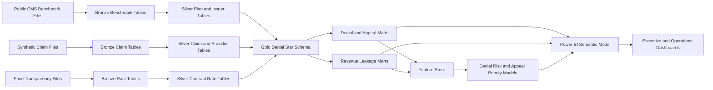

# Claims Denials, Appeals & Revenue Cycle Intelligence Platform

Single source of truth for building an enterprise-grade claims operations, denial analytics, appeal performance, and revenue cycle intelligence portfolio project.

This project is designed to look like work done by payer claims operations teams, provider revenue cycle teams, billing analytics teams, managed care teams, and healthcare finance teams. It should not look like a simple "claim status dashboard." It must show real insurance and healthcare operations thinking: claim intake, adjudication, denial reasons, appeal overturns, payer variation, service-line impact, reimbursement leakage, and operational work queues.

Target roles:

- Healthcare Data Analyst
- Insurance Analyst
- Claims Analyst
- Healthcare Business Analyst
- Healthcare BI Analyst
- Revenue Cycle Analyst
- Denials Analyst
- Payer Operations Analyst

Project title:

**Claims Denials, Appeals & Revenue Cycle Intelligence Platform**

Core business question:

**Where are claims being denied, appealed, delayed, underpaid, or lost, and what operational actions can reduce avoidable revenue leakage and administrative burden?**

---

## 1. Executive Project Charter

### 1.1 Business problem

Claims denials and payment friction are major operational problems for both providers and payers. Providers lose revenue and spend staff time on rework. Payers face member dissatisfaction, appeal volume, regulatory scrutiny, and administrative cost. Public claim-level denial data is limited, but public CMS marketplace, transparency, price transparency, and synthetic claims datasets can be combined to build a realistic enterprise simulation.

This project creates a governed analytics platform for:

- Denial benchmark analysis
- Appeal and overturn tracking
- Payer and plan denial comparison
- Claim-level denial simulation using transparent business rules
- Revenue leakage estimation
- Underpayment and negotiated-rate variance analysis
- Operational work queues for denials, appeals, and payment recovery
- Power BI executive and operational dashboards

### 1.2 Business goals

The platform should answer:

- Which issuers, plans, states, and network categories have the highest denial rates?
- Which denial reasons are driving avoidable administrative burden?
- Which denials should be appealed first?
- Which denied claims have the highest expected recovery value?
- Which service lines have the largest reimbursement leakage?
- Which payers or plans show unusual denial or appeal-upheld patterns?
- Which hospital services have large negotiated-rate variation?
- How much revenue could be recovered by reducing preventable denials?

### 1.3 Primary enterprise users

- Revenue Cycle Director: denial prevention, appeal prioritization, recovery
- Claims Operations Leader: claim status, backlog, rework, denial reasons
- Managed Care Contracting: payer performance and reimbursement variation
- Finance: revenue at risk, expected recovery, underpayment exposure
- Compliance: denial benchmarks and appeal outcomes
- BI Team: governed claims operations dashboards
- Payer Strategy Analyst: issuer/plan denial variation and member friction

### 1.4 What makes this project professional

The project must include:

- Public denial benchmark data with source links
- Claim-level simulated denial layer documented transparently
- Denial reason taxonomy based on realistic revenue cycle categories
- Appeal workflow model with status transitions
- Revenue leakage and expected recovery calculations
- SQL marts for denial rates, appeal rates, overturn rates, aging, and recovery
- Price transparency or contracted-rate variance module
- Python analytics for denial drivers and appeal prioritization
- ML model for denial risk or appeal success probability
- Power BI dashboards for executives and operational teams
- Clear limitations explaining public data constraints

---

## 2. Source Reference Register

Use these links in the README and documentation.

### 2.1 Public denial, appeal, and marketplace data

1. **CMS Health Insurance Exchange Public Use Files**
   - Link: https://www.cms.gov/marketplace/resources/data/public-use-files
   - Use: Marketplace plan and issuer public use files.
   - Key file: Transparency in Coverage PUF.
   - CMS describes TC-PUF as issuer and plan-level claims, appeals, and active URL data.

2. **CMS Transparency in Coverage PUF PY2026**
   - Link: https://catalog.data.gov/dataset/transparency-in-coverage-puf-py2026
   - Use: Claims received, claims denied, appeals, appeal outcomes by issuer/plan where available.
   - Limitation: Aggregate issuer/plan data, not individual claim-level records.

3. **CMS Transparency in Coverage PUF Data Dictionary**
   - Link: https://www.cms.gov/files/document/transparency-coverage-puf-datadictionary-py26.pdf
   - Use: Field definitions for claims received, denied, appeals, in-network/out-of-network, and denial reason fields.

4. **CMS Health Insurance State-Based Exchange Public Use Files**
   - Link: https://www.cms.gov/marketplace/resources/data/state-based-public-use-files
   - Use: State-based Exchange plan and issuer data where relevant.

5. **HealthCare.gov Plan Data**
   - Link: https://www.healthcare.gov/plan-data/
   - Use: Qualified health plan and stand-alone dental plan data.

6. **CMS Medical Loss Ratio Data and System Resources**
   - Link: https://www.cms.gov/marketplace/resources/data/medical-loss-ratio-data-systems-resources
   - Use: Issuer financial context: premiums, claims, quality improvement expenses, rebates.

7. **CMS Rate Review Data**
   - Link: https://www.cms.gov/marketplace/resources/data/rate-review-data
   - Use: Plan rate increase context and insurance market financial pressure.

### 2.2 Claim-level simulation and claims structure

8. **CMS Medicare Claims Synthetic Public Use Files**
   - Link: https://www.cms.gov/data-research/statistics-trends-and-reports/medicare-claims-synthetic-public-use-files
   - Use: Synthetic Medicare-style claims structure for claim-level service, provider, member, diagnosis, and payment data.

9. **CMS Synthetic Medicare Enrollment, Fee-for-Service Claims, and Prescription Drug Event PUF**
   - Link: https://data.cms.gov/collection/synthetic-medicare-enrollment-fee-for-service-claims-and-prescription-drug-event
   - User guide: https://data.cms.gov/sites/default/files/2023-05/d51e1218-68c3-4c7c-9598-0b81f22fe903/User%20Guide%20-%20CMS%20Synthetic%20RIF%20Files%20May%202023_AM508_v2.pdf
   - Use: Modern synthetic claims files in CMS RIF-style format.

10. **Basic Stand Alone Medicare Claims PUFs**
    - Link: https://www.cms.gov/data-research/statistics-trends-and-reports/basic-stand-alone-medicare-claims-public-use-files
    - Use: Public de-identified claim-specific files for selected Medicare analyses.

### 2.3 Price transparency and reimbursement context

11. **CMS Hospital Price Transparency**
    - Link: https://www.cms.gov/priorities/key-initiatives/hospital-price-transparency
    - Use: Standard charge and machine-readable file context.
    - CMS states hospitals must provide pricing information as a comprehensive machine-readable file and a consumer-friendly display of shoppable services.

12. **CMS Hospital Price Transparency Hospitals Page**
    - Link: https://www.cms.gov/hospital-price-transparency/hospitals
    - Use: Requirement that hospitals post standard charges, including gross charges, discounted cash prices, payer-specific negotiated charges, and de-identified minimum/maximum negotiated charges.

13. **CMS Hospital Price Transparency GitHub**
    - Link: https://github.com/CMSgov/hospital-price-transparency
    - Use: Data dictionaries, CSV templates, JSON schema, and validation tools for machine-readable files.

14. **CMS Hospital Price Transparency Resources**
    - Link: https://www.cms.gov/hospital-price-transparency/resources
    - Use: Implementation guides and current requirement resources.

### 2.4 Provider and plan reference data

15. **CMS NPPES NPI Files**
    - Link: https://download.cms.gov/nppes/NPI_Files.html
    - Use: Provider identity and taxonomy.

16. **CMS Provider Data Catalog**
    - Link: https://developer.cms.gov/provider-data/
    - Use: Optional hospital/provider details.

---

## 3. Final Dataset Strategy

### 3.1 Why this project needs a simulated claim-level layer

Public CMS Transparency in Coverage PUFs provide aggregate issuer/plan-level denial and appeal data. They do not provide individual claim-level adjudication events. A professional project should not pretend aggregate denial files contain claim-level operational detail.

Therefore this project uses a two-layer strategy:

1. **Real public benchmark layer**
   - CMS Transparency in Coverage PUF
   - Exchange plan and issuer PUFs
   - Medical Loss Ratio data
   - Rate Review data

2. **Transparent claim-level simulation layer**
   - CMS synthetic claims or synthetic RIF claims
   - Deterministic denial rules
   - Denial probabilities calibrated to public aggregate benchmark ranges
   - Clearly documented simulated denial reason taxonomy

This makes the project honest and enterprise-realistic.

### 3.2 Required datasets

Minimum:

- CMS Transparency in Coverage PUF
- CMS Exchange/Marketplace PUFs
- CMS synthetic claims data
- CMS Hospital Price Transparency schema/reference resources
- NPPES provider file

Optional:

- MLR PUF for issuer financial context
- Rate Review data for premium/rate context
- Hospital machine-readable files for a small selected market
- Provider Data Catalog for facility identity and quality context

### 3.3 Dataset use matrix

| Business need | Dataset | Use |
|---|---|---|
| Denial benchmarks | Transparency in Coverage PUF | Issuer/plan denial, appeals, appeal outcomes |
| Plan attributes | Exchange PUFs | Plan, issuer, market, metal level, geography |
| Financial context | MLR PUF | Issuer premium/claims/rebate context |
| Rate context | Rate Review | Proposed/approved premium changes |
| Claim-level simulation | CMS SynPUF or Synthetic RIF | Claim facts, provider, diagnosis, payment |
| Provider identity | NPPES | NPI, provider taxonomy, geography |
| Contract/rate variation | Hospital price transparency MRFs | Negotiated rates, gross charges, cash prices |

### 3.4 Datasets to avoid as primary source

Avoid:

- Generic auto insurance claims fraud files
- Toy claim status CSVs
- Manually invented 100-row denial datasets
- Flat dashboards with "approved/rejected/pending" only

---

## 4. Business Workflow Simulated

### 4.1 Claim lifecycle

The platform models this claim lifecycle:

1. Claim received
2. Claim validated
3. Claim adjudicated
4. Claim paid, denied, partially denied, or pended
5. Denied claim assigned denial reason
6. Appeal created if appropriate
7. Appeal reviewed
8. Appeal overturned, upheld, or partially overturned
9. Recovery or write-off recorded
10. Denial prevention opportunity reported

### 4.2 Denial reason taxonomy

Use these denial categories:

- Eligibility or coverage terminated
- Prior authorization missing
- Medical necessity
- Coding error
- Missing documentation
- Duplicate claim
- Timely filing
- Coordination of benefits
- Non-covered service
- Out-of-network service
- Benefit maximum exceeded
- Invalid provider identifier
- Bundling or modifier issue
- Experimental/investigational
- Referral missing

### 4.3 Appeal outcome taxonomy

Appeal outcomes:

- Not appealed
- Appealed pending
- Appeal upheld
- Appeal overturned
- Appeal partially overturned
- Appeal dismissed
- Resubmitted instead of appealed

### 4.4 Revenue actions

Operational actions:

- Appeal immediately
- Correct and resubmit
- Request documentation
- Verify eligibility
- Check authorization
- Contracting review
- Write off
- Monitor payer pattern
- Prevent future denial through front-end edit

---

## 5. End-to-End Pipeline



### 5.1 Layer definitions

Raw:

- Downloaded CMS PUFs, synthetic claims, NPPES, selected hospital price transparency files.

Bronze:

- Source-shaped tables with metadata.

Silver:

- Standardized claim, issuer, plan, provider, denial, appeal, and rate tables.

Gold:

- Star schema for claim operations and revenue cycle analytics.

Marts:

- Denial rate
- Appeal performance
- Recovery opportunity
- Revenue leakage
- Payer scorecard
- Service-line denial
- Aging and backlog

ML:

- Denial risk scoring
- Appeal success prediction
- Recovery prioritization

Power BI:

- Executive dashboard and operational work queues.

---

## 6. Repository Structure

```text
claims-denials-revenue-cycle-intelligence/
  README.md
  requirements.txt
  .gitignore

  docs/
    Claims_Denials_Revenue_Cycle_Analytics_Blueprint.md
    business_problem.md
    data_sources.md
    simulation_methodology.md
    architecture.md
    data_dictionary.md
    kpi_dictionary.md
    denial_reason_taxonomy.md
    appeal_workflow.md
    price_transparency_methodology.md
    dashboard_spec.md
    model_cards.md
    executive_summary.md
    portfolio_case_study.md
    interview_talking_points.md

  data/
    raw/
      transparency_coverage_puf/
      exchange_pufs/
      mlr_puf/
      rate_review/
      cms_synthetic_claims/
      nppes/
      hospital_price_transparency_sample/
    interim/
    processed/

  sql/
    00_admin/
    01_bronze_ddl/
    02_silver_transforms/
    03_gold_star_schema/
    04_simulation/
    05_marts/
    06_quality_tests/
    07_analytics_queries/

  src/
    etl/
    simulation/
    features/
    models/
    evaluation/
    reporting/

  notebooks/
    01_benchmark_data_profile.ipynb
    02_claim_simulation_validation.ipynb
    03_denial_eda.ipynb
    04_appeal_recovery_analysis.ipynb
    05_payer_scorecard_analysis.ipynb
    06_denial_risk_model.ipynb
    07_price_transparency_analysis.ipynb

  powerbi/
    denials_revenue_cycle_platform.pbip/
    exports/

  reports/
    figures/
    executive_summary.pdf
```

---

## 7. Data Architecture

### 7.1 Schemas

Use:

- `raw`
- `bronze`
- `silver`
- `gold`
- `sim`
- `mart`
- `ml`
- `dq`

### 7.2 Dimensions

#### dim_issuer

Grain: one row per issuer.

Columns:

- `issuer_key`
- `issuer_id`
- `issuer_name`
- `state_code`
- `market_type`
- `source_year`

#### dim_plan

Grain: one row per plan per plan year.

Columns:

- `plan_key`
- `plan_id`
- `issuer_key`
- `plan_year`
- `plan_name`
- `metal_level`
- `market_type`
- `network_type`
- `state_code`
- `service_area_id`
- `qhp_flag`

#### dim_member_simulated

Grain: one row per synthetic member.

Columns:

- `member_key`
- `member_id`
- `age_band`
- `sex`
- `state_code`
- `risk_segment`
- `coverage_status`
- `plan_key`

#### dim_provider

Grain: one row per provider/NPI or facility.

Columns:

- `provider_key`
- `npi`
- `provider_name`
- `provider_type`
- `specialty_group`
- `state_code`
- `taxonomy_code`
- `network_status`

#### dim_service

Grain: one row per procedure, HCPCS, DRG, or service group.

Columns:

- `service_key`
- `service_code`
- `service_description`
- `service_type`
- `service_line`
- `revenue_center`
- `requires_prior_auth_flag`
- `high_documentation_risk_flag`
- `medical_necessity_review_flag`

Service lines:

- Inpatient
- Outpatient surgery
- Emergency department
- Imaging
- Lab
- Durable medical equipment
- Professional E/M
- Behavioral health
- Pharmacy
- Therapy

#### dim_denial_reason

Grain: one row per denial reason code.

Columns:

- `denial_reason_key`
- `denial_reason_code`
- `denial_reason_category`
- `denial_reason_description`
- `preventable_flag`
- `front_end_edit_flag`
- `appealable_flag`
- `typical_owner`

Typical owners:

- Registration
- Eligibility
- Authorization
- Coding
- Clinical documentation
- Billing
- Contracting
- Payer policy

#### dim_date

Standard calendar dimension.

### 7.3 Facts

#### fact_claim

Grain: one row per synthetic claim.

Columns:

- `claim_key`
- `claim_id`
- `member_key`
- `plan_key`
- `issuer_key`
- `provider_key`
- `service_key`
- `claim_received_date_key`
- `service_from_date_key`
- `service_thru_date_key`
- `adjudication_date_key`
- `claim_type`
- `claim_status`
- `submitted_amount`
- `allowed_amount`
- `expected_payment_amount`
- `paid_amount`
- `member_responsibility_amount`
- `network_status`
- `prior_auth_required_flag`
- `prior_auth_present_flag`
- `documentation_required_flag`
- `documentation_present_flag`
- `timely_filing_flag`
- `duplicate_claim_flag`
- `simulated_flag`

#### fact_denial

Grain: one row per denied claim or denied claim line.

Columns:

- `denial_key`
- `claim_key`
- `denial_reason_key`
- `denial_date_key`
- `denied_amount`
- `preventable_flag`
- `appealable_flag`
- `denial_owner`
- `root_cause`
- `days_to_denial`
- `denial_status`

#### fact_appeal

Grain: one row per appeal event.

Columns:

- `appeal_key`
- `denial_key`
- `appeal_created_date_key`
- `appeal_submitted_date_key`
- `appeal_decision_date_key`
- `appeal_level`
- `appeal_status`
- `appeal_outcome`
- `appealed_amount`
- `recovered_amount`
- `days_to_appeal`
- `days_to_decision`
- `appeal_success_flag`

#### fact_denial_benchmark

Grain: issuer, plan, year, network category, denial category.

Columns:

- `issuer_key`
- `plan_key`
- `plan_year`
- `network_status`
- `claims_received`
- `claims_denied`
- `appeals_filed`
- `appeals_upheld`
- `appeals_overturned`
- `denial_rate`
- `appeal_rate`
- `appeal_upheld_rate`
- `appeal_overturn_rate`

#### fact_contract_rate

Grain: hospital, payer, plan, service, rate version.

Columns:

- `contract_rate_key`
- `provider_key`
- `issuer_key`
- `plan_key`
- `service_key`
- `rate_effective_date`
- `gross_charge`
- `discounted_cash_price`
- `payer_negotiated_rate`
- `deidentified_min_rate`
- `deidentified_max_rate`
- `rate_source_file`
- `rate_confidence_score`

#### fact_revenue_leakage

Grain: claim or denial.

Columns:

- `claim_key`
- `denial_key`
- `submitted_amount`
- `expected_payment_amount`
- `paid_amount`
- `denied_amount`
- `underpaid_amount`
- `recoverable_amount`
- `writeoff_amount`
- `expected_recovery_probability`
- `expected_recovery_value`
- `priority_score`

---

## 8. Claim-Level Denial Simulation Methodology

### 8.1 Why simulation is allowed

The simulation is used only to create operational claim-level workflow practice data. Public benchmark files remain the source for aggregate denial rates. The README must state:

"Claim-level denial events in this project are simulated from CMS synthetic claims using transparent business rules and calibrated against public aggregate denial benchmarks. They are not real patient or payer adjudication records."

### 8.2 Simulation inputs

Inputs:

- Claim type
- Service line
- Network status
- Prior authorization required flag
- Prior authorization present flag
- Documentation required flag
- Documentation present flag
- Duplicate claim flag
- Timely filing flag
- Member coverage status
- Provider network status
- Submitted amount
- Allowed amount
- Payer/plan benchmark denial rate

### 8.3 Denial rule hierarchy

Apply deterministic rules first:

1. If coverage inactive: deny for eligibility.
2. If duplicate claim flag: deny duplicate.
3. If timely filing flag is false: deny timely filing.
4. If prior authorization required and missing: deny prior authorization.
5. If documentation required and missing: deny missing documentation.
6. If network status is out of network and plan does not cover OON: deny out of network.
7. If service line is high medical necessity risk and diagnosis/procedure mismatch exists: deny medical necessity.
8. Otherwise assign paid or denied based on calibrated plan denial probability.

### 8.4 Denial probability calibration

For each plan or issuer:

```text
benchmark_denial_rate =
    claims_denied / claims_received
```

Simulation target:

```text
simulated_denial_rate should be within +/- 2 percentage points of benchmark_denial_rate
```

If plan-level benchmark missing:

- Use issuer-level benchmark.
- If issuer missing, use state-level benchmark.
- If state missing, use national benchmark.

### 8.5 Appeal simulation

Appeal probability:

- Higher for high-dollar denials.
- Higher for appealable categories.
- Lower for eligibility and timely filing.
- Higher for medical necessity and prior authorization if documentation can be supplied.

Appeal success probability:

- High for missing documentation after supplied documentation.
- Moderate for prior authorization disputes.
- Moderate for medical necessity.
- Low for eligibility and non-covered benefit.
- Low for timely filing unless exception exists.

Output:

- Appeal event rows
- Appeal outcome
- Recovered amount
- Days to appeal
- Days to decision

---

## 9. SQL Build Plan

### 9.1 SQL files to create

```text
sql/
  00_admin/
    create_schemas.sql
  01_bronze_ddl/
    bronze_transparency_coverage.sql
    bronze_exchange_plan_puf.sql
    bronze_mlr.sql
    bronze_rate_review.sql
    bronze_synthetic_claims.sql
    bronze_nppes.sql
    bronze_price_transparency.sql
  02_silver_transforms/
    silver_issuer.sql
    silver_plan.sql
    silver_claim.sql
    silver_provider.sql
    silver_service.sql
    silver_denial_benchmark.sql
    silver_contract_rate.sql
  03_gold_star_schema/
    dim_issuer.sql
    dim_plan.sql
    dim_provider.sql
    dim_service.sql
    dim_denial_reason.sql
    fact_claim.sql
    fact_denial.sql
    fact_appeal.sql
    fact_denial_benchmark.sql
    fact_contract_rate.sql
    fact_revenue_leakage.sql
  04_simulation/
    simulate_denial_rules.sql
    simulate_appeal_events.sql
    calibrate_denial_rates.sql
  05_marts/
    mart_denial_rate.sql
    mart_appeal_performance.sql
    mart_revenue_leakage.sql
    mart_payer_scorecard.sql
    mart_service_line_denials.sql
    mart_denial_work_queue.sql
    mart_underpayment_opportunity.sql
```

### 9.2 Denial benchmark mart

Output: `mart.mart_denial_rate`

Required fields:

- `plan_year`
- `issuer_id`
- `issuer_name`
- `plan_id`
- `state_code`
- `network_status`
- `claims_received`
- `claims_denied`
- `denial_rate`
- `appeals_filed`
- `appeal_rate`
- `appeals_upheld`
- `appeal_upheld_rate`
- `appeal_overturn_rate`
- `denial_rate_percentile`

SQL:

```sql
WITH base AS (
    SELECT
        b.plan_year,
        i.issuer_id,
        i.issuer_name,
        p.plan_id,
        p.state_code,
        b.network_status,
        SUM(b.claims_received) AS claims_received,
        SUM(b.claims_denied) AS claims_denied,
        SUM(b.appeals_filed) AS appeals_filed,
        SUM(b.appeals_upheld) AS appeals_upheld,
        SUM(b.appeals_overturned) AS appeals_overturned
    FROM gold.fact_denial_benchmark b
    JOIN gold.dim_issuer i
        ON b.issuer_key = i.issuer_key
    JOIN gold.dim_plan p
        ON b.plan_key = p.plan_key
    GROUP BY
        b.plan_year,
        i.issuer_id,
        i.issuer_name,
        p.plan_id,
        p.state_code,
        b.network_status
)
SELECT
    *,
    claims_denied * 1.0 / NULLIF(claims_received, 0) AS denial_rate,
    appeals_filed * 1.0 / NULLIF(claims_denied, 0) AS appeal_rate,
    appeals_upheld * 1.0 / NULLIF(appeals_filed, 0) AS appeal_upheld_rate,
    appeals_overturned * 1.0 / NULLIF(appeals_filed, 0) AS appeal_overturn_rate,
    PERCENT_RANK() OVER (
        PARTITION BY plan_year, state_code
        ORDER BY claims_denied * 1.0 / NULLIF(claims_received, 0)
    ) AS denial_rate_percentile
FROM base;
```

### 9.3 Claim-level denial mart

Output: `mart.mart_service_line_denials`

Required fields:

- `service_line`
- `issuer_name`
- `plan_name`
- `claim_count`
- `denied_claim_count`
- `denial_rate`
- `submitted_amount`
- `denied_amount`
- `recoverable_amount`
- `top_denial_reason`

SQL:

```sql
WITH claim_denials AS (
    SELECT
        s.service_line,
        i.issuer_name,
        p.plan_name,
        c.claim_key,
        c.submitted_amount,
        d.denial_key,
        d.denied_amount,
        rl.recoverable_amount,
        dr.denial_reason_category
    FROM gold.fact_claim c
    JOIN gold.dim_service s
        ON c.service_key = s.service_key
    JOIN gold.dim_issuer i
        ON c.issuer_key = i.issuer_key
    JOIN gold.dim_plan p
        ON c.plan_key = p.plan_key
    LEFT JOIN gold.fact_denial d
        ON c.claim_key = d.claim_key
    LEFT JOIN gold.dim_denial_reason dr
        ON d.denial_reason_key = dr.denial_reason_key
    LEFT JOIN gold.fact_revenue_leakage rl
        ON c.claim_key = rl.claim_key
)
SELECT
    service_line,
    issuer_name,
    plan_name,
    COUNT(DISTINCT claim_key) AS claim_count,
    COUNT(DISTINCT denial_key) AS denied_claim_count,
    COUNT(DISTINCT denial_key) * 1.0 / NULLIF(COUNT(DISTINCT claim_key), 0) AS denial_rate,
    SUM(submitted_amount) AS submitted_amount,
    SUM(COALESCE(denied_amount, 0)) AS denied_amount,
    SUM(COALESCE(recoverable_amount, 0)) AS recoverable_amount,
    MAX(denial_reason_category) AS top_denial_reason
FROM claim_denials
GROUP BY service_line, issuer_name, plan_name;
```

For production-grade top reason, replace `MAX` with a ranked CTE by denial count.

### 9.4 Appeal performance mart

Output: `mart.mart_appeal_performance`

Required fields:

- `denial_reason_category`
- `issuer_name`
- `service_line`
- `appeals_filed`
- `appeals_overturned`
- `appeals_upheld`
- `appeal_success_rate`
- `average_days_to_decision`
- `appealed_amount`
- `recovered_amount`
- `recovery_rate`

SQL:

```sql
SELECT
    dr.denial_reason_category,
    i.issuer_name,
    s.service_line,
    COUNT(a.appeal_key) AS appeals_filed,
    SUM(CASE WHEN a.appeal_outcome = 'Appeal overturned' THEN 1 ELSE 0 END) AS appeals_overturned,
    SUM(CASE WHEN a.appeal_outcome = 'Appeal upheld' THEN 1 ELSE 0 END) AS appeals_upheld,
    SUM(CASE WHEN a.appeal_success_flag = 1 THEN 1 ELSE 0 END) * 1.0
        / NULLIF(COUNT(a.appeal_key), 0) AS appeal_success_rate,
    AVG(a.days_to_decision) AS average_days_to_decision,
    SUM(a.appealed_amount) AS appealed_amount,
    SUM(a.recovered_amount) AS recovered_amount,
    SUM(a.recovered_amount) * 1.0 / NULLIF(SUM(a.appealed_amount), 0) AS recovery_rate
FROM gold.fact_appeal a
JOIN gold.fact_denial d
    ON a.denial_key = d.denial_key
JOIN gold.fact_claim c
    ON d.claim_key = c.claim_key
JOIN gold.dim_denial_reason dr
    ON d.denial_reason_key = dr.denial_reason_key
JOIN gold.dim_issuer i
    ON c.issuer_key = i.issuer_key
JOIN gold.dim_service s
    ON c.service_key = s.service_key
GROUP BY
    dr.denial_reason_category,
    i.issuer_name,
    s.service_line;
```

### 9.5 Denial work queue mart

Output: `mart.mart_denial_work_queue`

Purpose:

- Rank denials for operational review.

Required fields:

- `claim_id`
- `issuer_name`
- `plan_name`
- `provider_name`
- `service_line`
- `denial_reason_category`
- `denied_amount`
- `recoverable_amount`
- `expected_recovery_probability`
- `expected_recovery_value`
- `days_since_denial`
- `priority_score`
- `recommended_action`

SQL:

```sql
SELECT
    c.claim_id,
    i.issuer_name,
    p.plan_name,
    pr.provider_name,
    s.service_line,
    dr.denial_reason_category,
    d.denied_amount,
    rl.recoverable_amount,
    rl.expected_recovery_probability,
    rl.expected_recovery_value,
    DATEDIFF(day, dd.full_date, CURRENT_DATE) AS days_since_denial,
    (
        0.45 * COALESCE(rl.expected_recovery_value, 0)
        + 0.25 * COALESCE(rl.expected_recovery_probability, 0) * 1000
        + 0.15 * CASE WHEN dr.preventable_flag = 1 THEN 100 ELSE 0 END
        + 0.15 * CASE WHEN dr.appealable_flag = 1 THEN 100 ELSE 0 END
    ) AS priority_score,
    CASE
        WHEN dr.denial_reason_category = 'Missing documentation' THEN 'Submit documentation packet'
        WHEN dr.denial_reason_category = 'Prior authorization missing' THEN 'Validate authorization and appeal if supported'
        WHEN dr.denial_reason_category = 'Coding error' THEN 'Correct and resubmit'
        WHEN dr.denial_reason_category = 'Medical necessity' THEN 'Clinical appeal review'
        WHEN dr.denial_reason_category = 'Eligibility or coverage terminated' THEN 'Eligibility verification'
        WHEN dr.denial_reason_category = 'Underpayment' THEN 'Contracting payment review'
        ELSE 'Analyst review'
    END AS recommended_action
FROM gold.fact_denial d
JOIN gold.fact_claim c
    ON d.claim_key = c.claim_key
JOIN gold.dim_issuer i
    ON c.issuer_key = i.issuer_key
JOIN gold.dim_plan p
    ON c.plan_key = p.plan_key
JOIN gold.dim_provider pr
    ON c.provider_key = pr.provider_key
JOIN gold.dim_service s
    ON c.service_key = s.service_key
JOIN gold.dim_denial_reason dr
    ON d.denial_reason_key = dr.denial_reason_key
JOIN gold.dim_date dd
    ON d.denial_date_key = dd.date_key
LEFT JOIN gold.fact_revenue_leakage rl
    ON d.denial_key = rl.denial_key
WHERE d.denial_status IN ('Open', 'Appealable', 'Pending review');
```

### 9.6 Underpayment opportunity mart

Output: `mart.mart_underpayment_opportunity`

Logic:

- Compare expected payment to paid amount.
- If using hospital price transparency negotiated rates, compare claim paid amount to payer negotiated rate when service/provider/plan match.

Required fields:

- `claim_id`
- `provider_name`
- `issuer_name`
- `plan_name`
- `service_line`
- `expected_payment_amount`
- `paid_amount`
- `contract_rate_amount`
- `underpaid_amount`
- `underpayment_flag`
- `contract_review_flag`

---

## 10. Python Analytics Plan

### 10.1 EDA notebooks

#### `01_benchmark_data_profile.ipynb`

Outputs:

- Claims received by issuer/plan/state
- Claims denied by issuer/plan/state
- Denial rate distribution
- Appeal rate distribution
- Appeal upheld/overturn rate distribution
- Missingness by PUF field

#### `02_claim_simulation_validation.ipynb`

Outputs:

- Simulated denial rate vs benchmark denial rate
- Denial reason distribution
- Claim-level denied amount distribution
- Calibration error by issuer/plan
- Simulation assumptions report

#### `03_denial_eda.ipynb`

Outputs:

- Denial rate by service line
- Denial reason Pareto
- Denied amount by payer
- Preventable vs non-preventable denials
- Network status denial comparison

#### `04_appeal_recovery_analysis.ipynb`

Outputs:

- Appeal success by denial reason
- Recovery by service line
- Days to decision distribution
- Expected recovery value curve
- Appeal prioritization analysis

#### `05_payer_scorecard_analysis.ipynb`

Outputs:

- Payer denial scorecard
- Payer appeal overturn comparison
- Payer underpayment patterns
- Payer administrative burden index

#### `06_denial_risk_model.ipynb`

Outputs:

- Denial risk model
- Appeal success model
- SHAP drivers
- Threshold selection
- Work queue export

#### `07_price_transparency_analysis.ipynb`

Outputs:

- Negotiated rate variation by service
- Gross charge vs negotiated rate
- Payer-specific rate comparison
- Rate confidence score
- Underpayment opportunity examples

### 10.2 Feature engineering

Claim features:

- Claim type
- Service line
- Submitted amount
- Allowed amount
- Provider specialty
- Payer/issuer
- Plan metal level
- Network status
- Prior authorization required
- Prior authorization present
- Documentation required
- Documentation present
- Timely filing flag
- Duplicate claim flag
- Diagnosis category
- Procedure category
- Member risk segment

Denial features:

- Denial reason category
- Denied amount
- Preventable flag
- Appealable flag
- Days to denial
- Payer historical denial rate
- Service-line denial rate
- Provider denial rate

Appeal features:

- Appeal level
- Denial category
- Appealed amount
- Documentation supplied flag
- Clinical review flag
- Payer historical overturn rate
- Days from denial to appeal

---

## 11. ML Design

### 11.1 Model 1: Claim denial risk prediction

Business owner:

- Claims operations and revenue cycle.

Prediction unit:

- Claim.

Target:

- `denied_flag`.

Models:

- Logistic Regression
- Random Forest
- XGBoost

Metrics:

- ROC-AUC
- PR-AUC
- Recall at top decile
- Precision at K
- Confusion matrix
- SHAP

Business use:

- Flag high-risk claims before submission for front-end edits.

Recommended action:

- Check authorization
- Attach documentation
- Coding review
- Eligibility verification
- Medical necessity review

### 11.2 Model 2: Appeal success prediction

Prediction unit:

- Denial.

Target:

- `appeal_success_flag`.

Features:

- Denial reason
- Denied amount
- Service line
- Payer
- Documentation flag
- Days to appeal
- Historical payer overturn rate
- Preventable flag
- Appealable flag

Metrics:

- ROC-AUC
- PR-AUC
- Precision@K
- Expected recovery captured in top decile

Business use:

- Prioritize appeals with high expected recovery value.

Formula:

```text
expected_recovery_value =
    denied_amount * appeal_success_probability * expected_recovery_percentage
```

### 11.3 Model 3: Payer friction scoring

Purpose:

- Score payers/plans by administrative burden.

Scoring formula:

```text
payer_friction_score =
    0.35 * denial_rate_percentile
  + 0.20 * appeal_upheld_rate_percentile
  + 0.20 * average_days_to_decision_percentile
  + 0.15 * underpayment_rate_percentile
  + 0.10 * documentation_denial_share_percentile
```

Output tiers:

- Low friction
- Moderate friction
- High friction
- Contracting review required

---

## 12. Power BI Dashboard Specification

### 12.1 Pages

#### Page 1: Executive Denials Overview

KPI cards:

- Claims received
- Claims denied
- Denial rate
- Denied amount
- Recoverable amount
- Appeal success rate
- Expected recovery value
- Payer friction score

Visuals:

- Monthly denial trend
- Denial reason Pareto
- Denied amount by payer
- Recovery opportunity waterfall
- Denial rate by service line
- Payer friction matrix

#### Page 2: Payer and Plan Scorecard

KPI cards:

- Selected payer denial rate
- Appeal overturn rate
- Denied amount
- Underpayment amount
- Administrative burden index

Visuals:

- Payer ranking table
- Denial rate by plan
- Appeal outcome by payer
- In-network vs out-of-network denial comparison
- Payer friction score trend

#### Page 3: Service Line Denials

KPI cards:

- Highest-denial service line
- Preventable denial rate
- Medical necessity denial rate
- Authorization denial amount

Visuals:

- Service line denial heatmap
- Denial reason by service line
- Denied amount by procedure/service
- Preventable denial opportunity

#### Page 4: Appeal and Recovery Operations

KPI cards:

- Appeals filed
- Appeals pending
- Appeal success rate
- Recovered amount
- Average days to decision

Visuals:

- Appeal funnel
- Appeal outcome by denial reason
- Recovery by payer
- Aging of pending appeals
- Top recovery opportunities

#### Page 5: Denial Work Queue

Table columns:

- Claim ID
- Payer
- Plan
- Service line
- Denial reason
- Denied amount
- Expected recovery value
- Days since denial
- Priority score
- Recommended action

Filters:

- Payer
- Service line
- Denial reason
- Priority tier
- Appealability

#### Page 6: Price Transparency and Underpayment

KPI cards:

- Matched contract rate claims
- Underpayment amount
- Rate variance
- High-variance services

Visuals:

- Negotiated rate by payer
- Gross charge vs negotiated rate
- Paid amount vs expected rate
- Underpayment opportunity table

#### Page 7: Denial Risk Model

KPI cards:

- Scored claims
- High-risk claims
- Model ROC-AUC
- Top decile lift

Visuals:

- Risk score distribution
- SHAP feature drivers
- Threshold simulator
- High-risk pre-bill work queue

#### Page 8: Data Quality and Simulation Governance

Visuals:

- Benchmark row counts
- Simulation calibration error
- Missing payer/plan fields
- Claim-level simulation rate vs benchmark
- Last refresh
- Limitation notes

### 12.2 Core DAX measures

```DAX
Claims Received =
DISTINCTCOUNT(fact_claim[claim_key])

Denied Claims =
DISTINCTCOUNT(fact_denial[denial_key])

Denial Rate =
DIVIDE([Denied Claims], [Claims Received])

Denied Amount =
SUM(fact_denial[denied_amount])

Appeals Filed =
DISTINCTCOUNT(fact_appeal[appeal_key])

Appeal Rate =
DIVIDE([Appeals Filed], [Denied Claims])

Appeal Success Rate =
DIVIDE(
    CALCULATE(COUNTROWS(fact_appeal), fact_appeal[appeal_success_flag] = 1),
    [Appeals Filed]
)

Recovered Amount =
SUM(fact_appeal[recovered_amount])

Recoverable Amount =
SUM(fact_revenue_leakage[recoverable_amount])

Expected Recovery Value =
SUM(fact_revenue_leakage[expected_recovery_value])

Underpaid Amount =
SUM(fact_revenue_leakage[underpaid_amount])

Preventable Denial Rate =
DIVIDE(
    CALCULATE(DISTINCTCOUNT(fact_denial[denial_key]), dim_denial_reason[preventable_flag] = TRUE()),
    [Denied Claims]
)
```

---

## 13. KPI Dictionary

| KPI | Formula | Grain | Owner |
|---|---|---|---|
| Claims received | Count of submitted claims | Claim | Claims ops |
| Claims denied | Count of denied claims | Claim | Claims ops |
| Denial rate | Denied claims / claims received | Payer/plan/service | Revenue cycle |
| Denied amount | Sum denied amount | Denial | Finance |
| Preventable denial rate | Preventable denials / total denials | Denial | Revenue cycle |
| Appeal rate | Appeals filed / denied claims | Denial | Appeals team |
| Appeal success rate | Successful appeals / appeals filed | Appeal | Appeals team |
| Appeal upheld rate | Upheld appeals / appeals filed | Appeal | Appeals team |
| Recovery rate | Recovered amount / appealed amount | Appeal | Finance |
| Expected recovery value | Denied amount * appeal success probability * recovery percent | Denial | Finance |
| Underpaid amount | Expected payment - paid amount | Claim | Contracting |
| Payer friction score | Weighted denial, appeal, aging, underpayment score | Payer/plan | Managed care |
| Days to denial | Denial date - claim received date | Claim | Claims ops |
| Days to appeal | Appeal submitted date - denial date | Appeal | Appeals team |
| Days to decision | Appeal decision date - appeal submitted date | Appeal | Appeals team |
| Work queue priority score | Weighted expected recovery, appealability, preventability, aging | Denial | Operations |

---

## 14. Data Quality and Governance

### 14.1 Required tests

Benchmark data:

- Claims received >= claims denied.
- Denial rate between 0 and 1.
- Appeals filed <= claims denied unless source documentation explains otherwise.
- Appeal rates between 0 and 1.
- Plan year is valid.

Claim simulation:

- Every simulated claim has a plan and issuer.
- Every denied claim has one denial reason.
- Every appeal maps to a denial.
- Paid amount plus denied amount does not exceed submitted amount unless adjustment logic documented.
- Simulated denial rate is within target calibration tolerance.

Price transparency:

- Rates are numeric.
- Service codes are populated where available.
- Payer names standardized.
- Rate confidence score assigned.
- File source retained for auditability.

Work queues:

- Priority score is not null.
- Recommended action is not null.
- Closed denials excluded from open queue.

### 14.2 Governance notes

Required documentation:

- Simulation methodology
- Denial reason taxonomy
- Calibration approach
- Price transparency matching confidence
- Public data limitations
- No PHI statement

---

## 15. Business Insights To Generate

Minimum final insights:

1. Issuers/plans with highest denial rates.
2. States or markets with highest denial burden.
3. Denial reason categories driving most denied amount.
4. Preventable denial categories with biggest operational opportunity.
5. Appeal categories with highest recovery rate.
6. Denials where expected recovery value is highest.
7. Payers with high denial rates and high appeal upheld rates.
8. Service lines most exposed to medical necessity or prior authorization denials.
9. Underpayment opportunities from paid vs expected reimbursement.
10. Operational recommendations for front-end edits, coding review, and appeal prioritization.

---

## 16. Implementation Roadmap

### Phase 1: Data acquisition

Tasks:

- Download CMS Transparency in Coverage PUF.
- Download Exchange plan/issuer PUFs.
- Download MLR PUF if using financial context.
- Download Rate Review data if using rate context.
- Download CMS synthetic claims.
- Download NPPES provider file.
- Select 3 to 5 hospital price transparency files for a focused market if using negotiated-rate analysis.

Deliverable:

- `docs/data_sources.md`

### Phase 2: Benchmark warehouse

Tasks:

- Load TC-PUF.
- Build issuer and plan dimensions.
- Calculate benchmark denial, appeal, upheld, and overturn rates.
- Build payer benchmark mart.

Deliverable:

- `mart.mart_denial_rate`

### Phase 3: Claim simulation

Tasks:

- Load synthetic claim data.
- Create simulated member-plan assignment.
- Create service-line mapping.
- Create denial reason dimension.
- Apply denial rule hierarchy.
- Calibrate denial rates to benchmark.
- Simulate appeal events.

Deliverable:

- `gold.fact_claim`
- `gold.fact_denial`
- `gold.fact_appeal`
- `docs/simulation_methodology.md`

### Phase 4: Revenue leakage marts

Tasks:

- Calculate denied amount.
- Calculate recoverable amount.
- Calculate expected recovery value.
- Build denial work queue.
- Build appeal performance mart.
- Build service-line denial mart.

Deliverable:

- `mart.mart_revenue_leakage`
- `mart.mart_denial_work_queue`
- `mart.mart_appeal_performance`

### Phase 5: Price transparency and underpayment

Tasks:

- Parse selected hospital MRFs.
- Normalize payer, plan, service, negotiated rate.
- Match claim service/provider/plan to contract rate where possible.
- Calculate paid vs expected variance.
- Assign rate confidence score.

Deliverable:

- `mart.mart_underpayment_opportunity`

### Phase 6: Python and ML

Tasks:

- Run denial EDA.
- Build claim features.
- Train denial risk model.
- Train appeal success model.
- Build payer friction score.
- Export model scores.

Deliverable:

- Model notebooks and model cards.

### Phase 7: Power BI

Tasks:

- Build executive overview.
- Build payer scorecard.
- Build service-line denial page.
- Build appeal/recovery page.
- Build denial work queue.
- Build price transparency page.
- Build model monitoring page.
- Build data quality/governance page.

Deliverable:

- Power BI report and screenshots.

### Phase 8: Portfolio packaging

Tasks:

- Write README.
- Write case study.
- Write executive summary.
- Write KPI dictionary.
- Write interview talking points.

Deliverable:

- Portfolio-ready project.

---

## 17. README Outline

```text
# Claims Denials, Appeals & Revenue Cycle Intelligence Platform

## Executive Summary
## Business Problem
## Data Sources
## Important Simulation Disclaimer
## Architecture
## Denial Reason Taxonomy
## Data Model
## SQL Marts
## Python Analytics
## Machine Learning
## Power BI Dashboard
## Key Insights
## Limitations
## How To Run
## Interview Talking Points
```

---

## 18. Interview Talking Points

### 60-second pitch

"I built a claims denials and revenue cycle intelligence platform using CMS public denial benchmark files, Exchange plan data, synthetic claim records, provider reference data, and optional hospital price transparency files. Because public denial data is aggregate, I created a transparent simulated claim-level denial workflow calibrated to public benchmark rates. The platform tracks denial rates, appeal outcomes, recovery opportunity, payer friction, service-line denial patterns, underpayment variance, and operational work queues."

### SQL talking points

- Built issuer, plan, provider, service, denial reason, claim, denial, appeal, and revenue leakage tables.
- Created denial rate, appeal performance, payer scorecard, service-line denial, and work queue marts.
- Used rule hierarchy and calibration tables for denial simulation.
- Used window functions and percentiles for payer friction scoring.

### Business talking points

- Public denial data is mostly aggregate, so claim-level workflows must be simulated honestly.
- Denial analytics should separate preventable and non-preventable denials.
- Appeal prioritization should consider expected recovery value, not just denied amount.
- Payer scorecards should include denial rate, appeal outcomes, aging, and underpayment.
- Price transparency data is powerful but messy, requiring confidence scores and source retention.

### ML talking points

- Built a claim denial risk model for pre-bill edits.
- Built an appeal success model to prioritize high-value denials.
- Used SHAP to explain denial drivers.
- Used threshold analysis based on operational staff capacity.

### Resume bullets

- Built a claims denials and revenue cycle analytics platform integrating CMS Transparency in Coverage PUFs, Exchange plan data, synthetic claims, provider data, and price transparency references.
- Designed a transparent claim-level denial and appeal simulation calibrated to public issuer/plan denial benchmarks.
- Developed SQL marts for denial rates, appeal outcomes, payer scorecards, service-line denials, revenue leakage, underpayment opportunity, and operational work queues.
- Built ML pipelines for denial risk prediction and appeal success prioritization using business-threshold evaluation and expected recovery value.
- Created Power BI dashboards for executive denial performance, payer friction, appeal recovery, service-line root causes, underpayment, and denial work queues.

---

## 19. Final Acceptance Checklist

- Source links documented.
- TC-PUF benchmark tables loaded.
- Issuer and plan dimensions built.
- Synthetic claim data loaded.
- Denial reason taxonomy built.
- Claim-level denial simulation complete.
- Simulation calibration report complete.
- Appeal simulation complete.
- Denial rate mart complete.
- Appeal performance mart complete.
- Revenue leakage mart complete.
- Denial work queue complete.
- Payer scorecard complete.
- Underpayment module complete if using price transparency.
- Denial risk model complete.
- Appeal success model complete.
- Power BI dashboard complete.
- KPI dictionary complete.
- Simulation disclaimer present in README.
- Case study complete.

Final positioning:

**An enterprise claims operations and revenue cycle analytics platform that combines public CMS denial benchmarks, synthetic claim-level adjudication, appeal prioritization, reimbursement leakage analysis, and Power BI operational work queues to reduce avoidable denials and improve recovery performance.**

