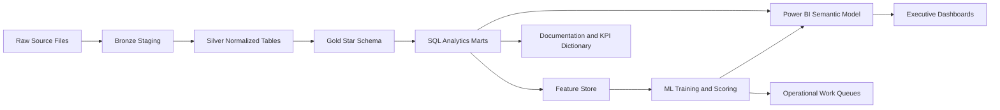
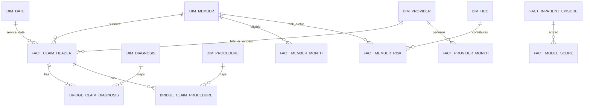

# Healthcare Claims Intelligence & Risk Analytics Platform

Single source of truth for building an enterprise-grade healthcare payer analytics portfolio project.

This document is written as a build blueprint, not a tutorial. It defines the business problem, data sources, warehouse architecture, SQL marts, Python analytics, ML pipelines, Power BI dashboards, KPI dictionary, quality checks, portfolio packaging, and interview story. The goal is to simulate the kind of work done by healthcare payer, Medicare Advantage, provider analytics, utilization management, care management, risk adjustment, and claims intelligence teams.

Target roles:

- Healthcare Data Analyst
- Insurance Analyst
- Healthcare Business Analyst
- Healthcare BI Analyst
- Population Health Analyst
- Risk Adjustment Analyst
- Claims Analyst

Primary project title:

**Healthcare Claims Intelligence & Risk Analytics Platform**

Recommended core stack:

- Data warehouse: SQL Server, PostgreSQL, or DuckDB
- Data processing: Python, pandas, polars, SQLAlchemy, dbt-style SQL folders
- Modeling: scikit-learn, xgboost, shap
- BI: Power BI
- Version control: GitHub
- Documentation: Markdown plus optional PDF export

---

## 1. Executive Project Charter

### 1.1 Business problem

Healthcare payers and Medicare Advantage organizations face rising medical costs, avoidable admissions, complex provider networks, claim payment variation, fraud/waste/abuse exposure, denied claim friction, and incomplete risk capture. A professional analytics team needs a governed platform that can answer operational questions across claims, members, providers, utilization, readmissions, risk adjustment, and financial performance.

This project simulates a payer analytics platform that turns raw claims files into:

- Claims financial intelligence
- High-cost member identification
- Provider performance benchmarking
- Avoidable readmission analytics
- Utilization management reporting
- Fraud/waste/anomaly detection
- HCC/RAF risk adjustment analytics
- Machine learning driven intervention queues
- Executive Power BI dashboards

### 1.2 Business goals

The platform should help a payer answer:

- Which members are driving the top 5 percent of paid cost?
- Which provider groups have unusually high paid amounts, procedure intensity, or readmission patterns after risk adjustment?
- Which inpatient discharges are followed by a 30-day readmission?
- Which members should be prioritized for care management?
- Which claims or providers should be routed to fraud/waste/abuse review?
- Which chronic conditions and HCCs drive risk score and expected cost?
- Where are denial, appeal, or payment benchmarks concerning?
- What savings could be achieved by reducing avoidable readmissions, provider outliers, and preventable high-cost utilization?

### 1.3 Target enterprise users

- Chief Medical Officer: quality, readmissions, chronic condition burden
- CFO or finance analytics team: PMPM, paid cost, trend, savings opportunity
- Claims operations leader: claim volume, allowed/paid amounts, denial benchmarks
- Provider network team: provider outliers, specialty benchmarking, contract performance
- Care management team: high-risk member worklist
- Utilization management team: inpatient, ED, SNF, post-acute trends
- Risk adjustment team: HCC capture, RAF segmentation, chronic condition recurrence
- Special investigations unit: fraud/waste/abuse work queue

### 1.4 What makes this enterprise-grade

This project is not a chart-only portfolio artifact. It must include:

- A documented data architecture with raw, staging, warehouse, mart, and BI layers
- Star schema fact and dimension tables
- SQL scripts with repeatable transformations and analytics marts
- Claims grain definitions and member-month logic
- Advanced SQL using CTEs, joins, window functions, percentiles, and rolling calculations
- Python notebooks and scripts for EDA, feature engineering, modeling, and explainability
- Power BI dashboards designed around actual payer workflows
- KPI dictionary and data dictionary
- Model cards and business threshold logic
- Clear limitations and assumptions
- Interview-ready business interpretation

---

## 2. Source Reference Register

Use these links in the README, documentation, and GitHub references section.

### 2.1 Core claims and payer data

1. **CMS Medicare Claims Synthetic Public Use Files (DE-SynPUF)**
   - Link: https://www.cms.gov/data-research/statistics-trends-and-reports/medicare-claims-synthetic-public-use-files
   - Use: Primary claims warehouse backbone.
   - Why it matters: CMS states the SynPUFs use Medicare-like formats and variable names so users can gain familiarity with Medicare claims data while protecting beneficiary privacy.

2. **CMS 2008-2010 Data Entrepreneurs Synthetic Public Use File**
   - Link: https://www.cms.gov/data-research/statistics-trends-and-reports/medicare-claims-synthetic-public-use-files/cms-2008-2010-data-entrepreneurs-synthetic-public-use-file-de-synpuf
   - Use: Download beneficiary, inpatient, outpatient, carrier, and prescription drug event files.

3. **CMS Synthetic Medicare Enrollment, Fee-for-Service Claims, and Prescription Drug Event PUF**
   - Link: https://data.cms.gov/collection/synthetic-medicare-enrollment-fee-for-service-claims-and-prescription-drug-event
   - User guide: https://data.cms.gov/sites/default/files/2023-05/d51e1218-68c3-4c7c-9598-0b81f22fe903/User%20Guide%20-%20CMS%20Synthetic%20RIF%20Files%20May%202023_AM508_v2.pdf
   - Use: More modern CMS RIF-style synthetic Medicare files.
   - Why it matters: The user guide describes a synthetic public dataset representing enrollment, healthcare claims, and prescription drug events for 8,671 Medicare beneficiaries.

4. **Kaggle CMS SynPUF synthetic claims 55M**
   - Link: https://www.kaggle.com/datasets/drscarlat/cmssynpuf55m
   - Use: Larger-scale version for realistic row counts.
   - Recommended use: Use only if your local machine can handle large files with DuckDB, SQL Server bulk load, or parquet conversion.

5. **Kaggle MedicalClaimsSynthetic1M**
   - Link: https://www.kaggle.com/datasets/drscarlat/medicalclaimssynthetic1m
   - Use: Faster starter option based on CMS synthetic claims.
   - Recommended use: Use for initial development if 55M is too heavy.

### 2.2 Fraud and waste data

6. **Kaggle Healthcare Provider Fraud Detection Analysis**
   - Link: https://www.kaggle.com/datasets/rohitrox/healthcare-provider-fraud-detection-analysis
   - Use: Supervised provider fraud model.
   - Tables: beneficiary data, inpatient claims, outpatient claims, provider fraud label.
   - Strength: Good for provider-level fraud modeling.
   - Limitation: Overused and usually modeled as a standalone Kaggle problem. In this project it should be one module inside a larger payer platform.

7. **Kaggle Healthcare Fraud Detection Dataset**
   - Link: https://www.kaggle.com/datasets/jaiswalmagic1/healthcare-fraud-detection-dataset
   - Use: Optional synthetic fraud practice data.
   - Limitation: Synthetic and less authoritative than CMS-style claims.

### 2.3 Provider performance and quality data

8. **CMS Medicare Physician and Other Practitioners by Provider and Service**
   - Link: https://catalog.data.gov/dataset/medicare-physician-other-practitioners-by-provider-and-service
   - Use: Provider benchmarking by NPI, HCPCS, place of service, submitted charges, allowed amount, payment, utilization.

9. **CMS Hospital Quality Initiative / Care Compare**
   - Link: https://www.cms.gov/medicare/quality/initiatives/hospital-quality-initiative/hospital-compare
   - Provider data catalog: https://developer.cms.gov/provider-data/
   - Use: Hospital quality, star rating, readmission, patient experience, and process/outcome context.

10. **CMS Hospital Readmissions Reduction Program (HRRP)**
    - Link: https://www.cms.gov/medicare/payment/prospective-payment-systems/acute-inpatient-pps/hospital-readmissions-reduction-program-hrrp
    - Use: Readmission program context and public hospital readmission measures.
    - Why it matters: HRRP uses 30-day risk-standardized unplanned readmission measures for AMI, COPD, HF, pneumonia, CABG, and THA/TKA.

11. **HHS COVID-19 Hospital Capacity Facility-Level Data**
    - Link: https://catalog.data.gov/dataset/covid-19-reported-patient-impact-and-hospital-capacity-by-facility-raw
    - Use: Optional utilization and capacity overlay.
    - Recommended use: Only if adding a hospital operations page.

### 2.4 Risk adjustment and coding

12. **CMS Risk Adjustment**
    - Link: https://www.cms.gov/medicare/payment/medicare-advantage-rates-statistics/risk-adjustment
    - Use: CMS-HCC model software, diagnosis mappings, and risk adjustment documentation.

13. **CMS ICD-10**
    - Link: https://www.cms.gov/medicare/coding-billing/icd-10-codes
    - Use: ICD-10 code files and coding documentation.

### 2.5 Denials and marketplace insurance benchmarks

14. **CMS Health Insurance Exchange Public Use Files**
    - Link: https://www.cms.gov/marketplace/resources/data/public-use-files
    - Use: Marketplace issuer/plan public use files.

15. **CMS Transparency in Coverage PUF**
    - Link: https://catalog.data.gov/dataset/transparency-in-coverage-puf-py2026
    - Use: Issuer and plan-level claims, appeals, denial data.
    - Important: This is aggregate benchmark data, not member-level claim adjudication data.

### 2.6 Clinical readmission data

16. **MIMIC-IV v3.1**
    - Link: https://physionet.org/content/mimiciv/3.1/
    - Use: Optional advanced provider-side readmission and clinical utilization module.
    - Access: Requires credentialed PhysioNet access, data use agreement, and training.

17. **UCI Diabetes 130-US Hospitals for Years 1999-2008**
    - Link: https://archive.ics.uci.edu/dataset/296/diabetes%2B130-us-hospitals%2Bfor-years%2B1999-2008
    - Use: Readmission ML benchmark.
    - Strength: 101,766 encounters, 47 features, 30-day readmission target.
    - Limitation: Very common; use only as a secondary model, not the flagship dataset.

### 2.7 Synthetic patient generation

18. **Synthea**
    - Link: https://synthetichealth.github.io/synthea/
    - GitHub: https://github.com/synthetichealth/synthea
    - Use: Optional generation of modern synthetic patient records with encounters, conditions, medications, claims, and FHIR/CSV outputs.
    - Strength: Good if you want ICD-10 and FHIR-style modern healthcare data.

### 2.8 Portfolio comparison references

19. **claimsdb GitHub**
    - Link: https://github.com/jfangmeier/claimsdb
    - Use: Example of relational access to CMS DE-SynPUF samples.
    - Lesson: Good source for understanding how to package claims data relationally.

20. **Example Healthcare Provider Fraud Project**
    - Link: https://github.com/pradlanka/medical-fraud-detection-analysis
    - Use: Benchmark for common Kaggle fraud modeling.
    - Lesson: Useful modeling approach, but a flagship portfolio should add warehouse architecture, SQL marts, business workflow, and BI.

---

## 3. Dataset Decision and Final Recommendation

### 3.1 Final recommended dataset architecture

Use a layered dataset strategy:

**Primary claims backbone**

- Start with CMS DE-SynPUF or Kaggle MedicalClaimsSynthetic1M.
- Upgrade to Kaggle CMS SynPUF 55M if performance allows.
- Use CMS Synthetic Medicare RIF PUF if you want more modern CMS RIF-style documentation and ICD-10-style workflows.

**Provider enrichment**

- Use CMS Physician and Other Practitioners by Provider and Service.
- Use CMS Care Compare or Hospital Quality Initiative for hospital quality context.

**Risk adjustment**

- Use CMS Risk Adjustment model software and ICD mappings.
- If the claims data uses ICD-9, document the limitation and use historical HCC mapping logic. If using ICD-10 synthetic RIF or Synthea, use current CMS-HCC mappings.

**Fraud/waste modeling**

- Use Kaggle Healthcare Provider Fraud Detection Analysis for supervised labels.
- Use anomaly detection on CMS-style claims for unsupervised provider outlier scoring.

**Readmission modeling**

- Use CMS claims inpatient episodes for SQL-based readmission logic.
- Add MIMIC-IV only if credentialed.
- Add UCI Diabetes as a benchmark model if you want a clean public readmission target.

**Denial analytics**

- Use CMS Transparency in Coverage PUF as aggregate denial benchmark.
- Do not pretend SynPUF has real claim denial adjudication unless you simulate explicit denial rules.

### 3.2 Dataset role matrix

| Need | Best dataset | Use in project | Portfolio value |
|---|---|---|---|
| Claims analytics | CMS DE-SynPUF / CMS SynPUF 55M | Claim header, claim line, diagnosis, procedure, paid amount | Very high |
| Member analytics | CMS beneficiary files | Member demographics, eligibility months, chronic flags | Very high |
| Provider analytics | CMS provider claims plus Physician Provider Utilization | Provider ranking, peer benchmarks | High |
| Fraud/waste | Kaggle provider fraud plus outlier detection | Supervised fraud model and audit queue | High |
| Readmission | Inpatient claims, MIMIC-IV, UCI Diabetes | 30-day readmission logic and prediction | High |
| HCC/RAF | CMS Risk Adjustment | Diagnosis to HCC grouping, RAF segmentation | Very high |
| Denials | CMS Transparency in Coverage PUF | Issuer/plan benchmark dashboard | Medium |
| Hospital operations | HHS capacity, Care Compare | Utilization and quality context | Medium |

### 3.3 Explicit datasets to avoid as primary source

Avoid making these the flagship source:

- 1,338-row medical insurance cost dataset
- Generic health insurance cross-sell data
- Tiny self-made fake insurance CSVs
- Single-table hospital dashboards
- Any dataset without member/provider/claim relationships

These can be mentioned as "not chosen" in the README to show judgment.

---

## 4. Business Domain Model

### 4.1 Payer workflow being simulated

The project simulates a Medicare-style payer analytics environment:

1. Members enroll in a plan.
2. Members receive services from providers.
3. Providers submit inpatient, outpatient, professional, and pharmacy claims.
4. Claims carry diagnosis codes, procedure codes, service dates, paid amounts, provider identifiers, and claim type.
5. The payer monitors cost, utilization, quality, risk adjustment, and provider performance.
6. Analytics teams create operational work queues for care management, utilization management, risk adjustment, and fraud/waste/abuse review.

### 4.2 Core business entities

- Member: person covered by the plan
- Claim: billable healthcare transaction
- Claim line: service-level detail inside a claim
- Provider: billing, rendering, attending, operating, or facility provider
- Diagnosis: ICD code describing condition
- Procedure: ICD procedure, CPT, or HCPCS service
- Drug: Part D prescription event
- Episode: inpatient admission and discharge event
- Member month: monthly eligibility unit for PMPM calculations
- HCC: hierarchical condition category used for risk adjustment
- Risk score: RAF-like member risk weight
- Intervention: member/provider/case flagged for action

### 4.3 Core business questions

Claims finance:

- What is total submitted, allowed, and paid amount by month, claim type, geography, provider, diagnosis, and procedure?
- What is PMPM by plan, state, age band, chronic condition, and risk segment?
- Which claim types are driving trend?

Population health:

- What is chronic condition prevalence by member segment?
- Which members have multi-morbidity and rising utilization?
- Which members are likely to become high-cost next period?

Provider performance:

- Which providers are outliers after peer comparison?
- Which providers have high readmission rate, high paid-per-member, high procedure intensity, or abnormal place-of-service mix?
- Which provider groups should be targeted for contracting or education?

Utilization management:

- What are admits per 1,000, ED visits per 1,000, inpatient days per 1,000, and average length of stay?
- Which members have repeat ED or inpatient utilization?
- Which discharges need follow-up to reduce readmission?

Risk adjustment:

- Which members have HCC-eligible chronic conditions?
- Which HCCs are recurring year over year?
- Which members have documented chronic conditions that are not captured in the current risk year?

Fraud/waste/abuse:

- Which providers show duplicate billing, unusually high service frequency, excessive paid amount, or abnormal procedure mix?
- Which providers should be sent to SIU for review?

Denials:

- How do issuer-level denial benchmarks compare by state, plan, or market?
- Which denial categories deserve operational investigation?

---

## 5. End-to-End Pipeline

### 5.1 Pipeline diagram



### 5.2 Layer definitions

**Raw layer**

- Original downloaded CSV/TXT files.
- No edits.
- Store in `data/raw/source_name/year_or_sample/`.

**Bronze staging**

- One table per source file.
- Minimal data type casting.
- Preserve original column names where useful.
- Add `source_file`, `ingested_at`, `record_hash`.

**Silver normalized**

- Standardized data types.
- Standardized date columns.
- Member, provider, claim, diagnosis, procedure, and drug identifiers normalized.
- Wide diagnosis columns unpivoted into diagnosis bridge table.
- Wide procedure columns unpivoted into procedure bridge table.

**Gold star schema**

- Fact and dimension tables for BI and analytics.
- Surrogate keys.
- Business-friendly fields.
- Clean measures.

**SQL marts**

- Reusable analytic outputs.
- Examples: `mart_member_month_pmpm`, `mart_provider_performance`, `mart_readmission`, `mart_fwa_queue`, `mart_hcc_risk`.

**Feature store**

- Model-ready member/provider/episode features.
- Leakage-controlled time windows.
- Separate training and scoring views.

**BI semantic model**

- Power BI model connected to gold tables and marts.
- DAX measures built from governed KPI definitions.

---

## 6. Repository Structure

Create this exact repository layout.

```text
healthcare-claims-intelligence-risk-analytics/
  README.md
  LICENSE
  requirements.txt
  pyproject.toml
  .gitignore
  .env.example

  docs/
    Healthcare_Claims_Intelligence_Project_Blueprint.md
    business_problem.md
    data_sources.md
    architecture.md
    kpi_dictionary.md
    data_dictionary.md
    hcc_raf_methodology.md
    sql_mart_catalog.md
    dashboard_spec.md
    model_cards.md
    executive_summary.md
    portfolio_case_study.md
    interview_talking_points.md

  data/
    raw/
      cms_desynpuf/
      cms_synthetic_rif/
      cms_provider_utilization/
      cms_care_compare/
      cms_hcc_mappings/
      kaggle_provider_fraud/
      uci_diabetes/
    interim/
    processed/
    sample_outputs/

  sql/
    00_admin/
      create_database.sql
      create_schemas.sql
    01_bronze_ddl/
      bronze_cms_desynpuf.sql
      bronze_provider_utilization.sql
      bronze_hcc_mapping.sql
      bronze_denial_benchmark.sql
    02_silver_transforms/
      silver_claim_header.sql
      silver_claim_diagnosis_bridge.sql
      silver_claim_procedure_bridge.sql
      silver_member.sql
      silver_provider.sql
      silver_pharmacy.sql
    03_gold_star_schema/
      dim_date.sql
      dim_member.sql
      dim_provider.sql
      dim_diagnosis.sql
      dim_procedure.sql
      dim_hcc.sql
      fact_claim_header.sql
      fact_claim_line.sql
      fact_member_month.sql
      fact_inpatient_episode.sql
      fact_provider_month.sql
      fact_member_risk.sql
    04_marts/
      mart_claims_financials.sql
      mart_member_month_pmpm.sql
      mart_high_cost_members.sql
      mart_readmission_30day.sql
      mart_provider_performance.sql
      mart_fwa_provider_flags.sql
      mart_hcc_risk_adjustment.sql
      mart_denial_benchmark.sql
    05_quality_tests/
      test_claim_keys.sql
      test_member_months.sql
      test_paid_amounts.sql
      test_date_ranges.sql
      test_referential_integrity.sql
    06_analytics_queries/
      q01_cost_trend_pmpm.sql
      q02_top_high_cost_members.sql
      q03_provider_peer_ranking.sql
      q04_readmission_drivers.sql
      q05_fwa_audit_queue.sql
      q06_hcc_gap_analysis.sql

  src/
    config/
      settings.py
    etl/
      load_raw_files.py
      validate_raw_files.py
      build_duckdb.py
      export_powerbi_tables.py
    features/
      member_features.py
      provider_features.py
      episode_features.py
    models/
      train_readmission_model.py
      train_high_cost_model.py
      train_fraud_model.py
      score_work_queues.py
    evaluation/
      evaluate_classification.py
      shap_explainability.py
      threshold_analysis.py
    reporting/
      generate_data_dictionary.py
      generate_model_cards.py

  notebooks/
    01_source_data_profile.ipynb
    02_claims_eda.ipynb
    03_member_pmpm_analysis.ipynb
    04_provider_performance_analysis.ipynb
    05_readmission_modeling.ipynb
    06_fraud_waste_detection.ipynb
    07_high_cost_prediction.ipynb
    08_hcc_raf_analysis.ipynb

  powerbi/
    claims_intelligence_platform.pbip/
    exports/
      dashboard_screenshots/
      executive_pdf/

  reports/
    figures/
    tables/
    executive_summary.pdf
    portfolio_case_study.pdf

  tests/
    test_feature_engineering.py
    test_model_inputs.py
    test_kpi_calculations.py
```

---

## 7. Data Architecture

### 7.1 Schemas

Use separate database schemas:

- `raw`: original loaded files
- `bronze`: typed staging tables
- `silver`: normalized source-aligned tables
- `gold`: conformed dimensional model
- `mart`: analytics marts
- `ml`: feature store and model scores
- `dq`: quality test results

### 7.2 Grain rules

Every table must have a documented grain.

| Table | Grain | Primary use |
|---|---|---|
| `dim_member` | One row per member | Demographics, eligibility, segmentation |
| `dim_provider` | One row per provider/facility identifier | Provider benchmarking |
| `dim_date` | One row per calendar date | Time intelligence |
| `dim_diagnosis` | One row per diagnosis code | ICD grouping |
| `dim_procedure` | One row per procedure/HCPCS code | Service grouping |
| `dim_hcc` | One row per HCC category | Risk adjustment |
| `fact_claim_header` | One row per claim | Claim-level payments and dates |
| `fact_claim_line` | One row per service line if line data exists | Procedure/service-level analysis |
| `bridge_claim_diagnosis` | One row per claim-diagnosis position | Multi-diagnosis analysis |
| `bridge_claim_procedure` | One row per claim-procedure position | Multi-procedure analysis |
| `fact_member_month` | One row per member per eligible month | PMPM denominator |
| `fact_inpatient_episode` | One row per inpatient stay | Readmissions, LOS |
| `fact_provider_month` | One row per provider per month | Provider trend and peer benchmarking |
| `fact_member_risk` | One row per member per risk year | HCC/RAF segmentation |
| `fact_model_score` | One row per scored entity per model run | Operational queue |

### 7.3 Key relationships



### 7.4 Core table specifications

#### dim_member

Purpose: member demographics, geography, enrollment, chronic condition flags.

Required columns:

- `member_key` integer surrogate key
- `member_id` source beneficiary identifier
- `birth_date`
- `death_date`
- `sex`
- `race`
- `state_code`
- `county_code`
- `age`
- `age_band`
- `medicare_eligibility_reason`
- `part_a_months`
- `part_b_months`
- `hmo_months`
- `part_d_months`
- `chronic_alzheimer`
- `chronic_heart_failure`
- `chronic_kidney_disease`
- `chronic_cancer`
- `chronic_copd`
- `chronic_depression`
- `chronic_diabetes`
- `chronic_ischemic_heart`
- `chronic_osteoporosis`
- `chronic_rheumatoid_arthritis`
- `chronic_stroke`
- `created_at`
- `updated_at`

#### dim_provider

Purpose: provider and facility rollups.

Required columns:

- `provider_key`
- `provider_id`
- `npi`
- `facility_provider_number`
- `provider_name`
- `provider_type`
- `specialty`
- `state_code`
- `place_of_service_default`
- `source_system`
- `provider_peer_group`

Provider peer groups:

- Primary care
- Cardiology
- Orthopedics
- Emergency medicine
- Internal medicine
- Hospital/facility
- DME/supplier
- Other professional

If SynPUF provider details are limited, use a generated peer group based on claim type, place of service, or joined CMS provider utilization specialty.

#### fact_claim_header

Purpose: one row per adjudicated claim.

Required columns:

- `claim_key`
- `claim_id`
- `member_key`
- `billing_provider_key`
- `rendering_provider_key`
- `attending_provider_key`
- `operating_provider_key`
- `claim_type`
- `claim_from_date_key`
- `claim_thru_date_key`
- `claim_from_date`
- `claim_thru_date`
- `claim_paid_date`
- `submitted_amount`
- `allowed_amount`
- `paid_amount`
- `primary_payer_paid_amount`
- `member_responsibility_amount`
- `deductible_amount`
- `coinsurance_amount`
- `claim_status`
- `place_of_service`
- `revenue_center_code`
- `admission_date`
- `discharge_date`
- `length_of_stay`
- `principal_diagnosis_code`
- `admitting_diagnosis_code`
- `primary_procedure_code`
- `drg_code`
- `source_file`

Claim types:

- Inpatient
- Outpatient
- Carrier/professional
- Pharmacy/PDE
- DME if available
- SNF/home health/hospice if using modern RIF files

#### fact_member_month

Purpose: PMPM denominator and eligibility tracking.

Required columns:

- `member_month_key`
- `member_key`
- `year_month`
- `month_start_date`
- `month_end_date`
- `is_eligible`
- `is_part_a_eligible`
- `is_part_b_eligible`
- `is_part_d_eligible`
- `is_hmo_enrolled`
- `plan_id`
- `risk_segment`
- `age_band`
- `state_code`

Important rule:

- For payer PMPM analytics, exclude months where the member is not eligible.
- For traditional Medicare FFS SynPUF analysis, document HMO month treatment. Many analyses exclude HMO months because claims may be incomplete for managed care months.

#### fact_inpatient_episode

Purpose: readmission, inpatient utilization, and LOS analytics.

Required columns:

- `episode_key`
- `claim_key`
- `member_key`
- `facility_provider_key`
- `admission_date`
- `discharge_date`
- `length_of_stay`
- `discharge_status`
- `principal_diagnosis_code`
- `drg_code`
- `index_admission_flag`
- `readmission_30day_flag`
- `days_to_next_admission`
- `next_admission_date`
- `readmission_claim_key`
- `condition_group`
- `planned_readmission_exclusion_flag`

Simplified readmission logic:

- Index event: inpatient discharge.
- Readmission: next inpatient admission for same member within 30 days after discharge.
- Exclude same-day transfers when the next admission date equals discharge date and provider/facility differs.
- Optional: exclude planned readmissions using procedure or DRG rules if available.

#### fact_member_risk

Purpose: risk adjustment and chronic condition segmentation.

Required columns:

- `member_risk_key`
- `member_key`
- `risk_year`
- `hcc_count`
- `hcc_list`
- `chronic_condition_count`
- `demographic_factor`
- `disease_factor`
- `interaction_factor`
- `raf_score_estimate`
- `risk_segment`
- `last_hcc_capture_date`
- `suspected_gap_count`
- `recaptured_hcc_count`

Risk segments:

- Low risk: RAF estimate less than 0.7
- Moderate risk: RAF estimate 0.7 to 1.2
- High risk: RAF estimate 1.2 to 2.5
- Very high risk: RAF estimate above 2.5

Document that RAF is an estimate unless full CMS model software is implemented.

---

## 8. Source-to-Target Mapping

### 8.1 CMS DE-SynPUF mapping

Common SynPUF source tables:

- Beneficiary Summary
- Inpatient Claims
- Outpatient Claims
- Carrier Claims
- Prescription Drug Event

Key beneficiary fields to map:

| Source field concept | Target |
|---|---|
| beneficiary ID | `dim_member.member_id` |
| birth date | `dim_member.birth_date` |
| death date | `dim_member.death_date` |
| sex code | `dim_member.sex` |
| race code | `dim_member.race` |
| state code | `dim_member.state_code` |
| county code | `dim_member.county_code` |
| Part A months | `dim_member.part_a_months` and `fact_member_month` |
| Part B months | `dim_member.part_b_months` and `fact_member_month` |
| HMO months | exclusion or flag in `fact_member_month` |
| chronic condition flags | `dim_member` and `fact_member_risk` |

Key inpatient fields to map:

| Source field concept | Target |
|---|---|
| claim ID | `fact_claim_header.claim_id` |
| beneficiary ID | `fact_claim_header.member_key` |
| claim from/thru date | `fact_claim_header.claim_from_date`, `claim_thru_date` |
| claim payment amount | `fact_claim_header.paid_amount` |
| primary payer paid amount | `fact_claim_header.primary_payer_paid_amount` |
| provider number | `dim_provider.provider_id` |
| attending physician NPI | `fact_claim_header.attending_provider_key` |
| operating physician NPI | `fact_claim_header.operating_provider_key` |
| admission date | `fact_inpatient_episode.admission_date` |
| discharge date | `fact_inpatient_episode.discharge_date` |
| diagnosis codes 1 to N | `bridge_claim_diagnosis` |
| procedure codes 1 to N | `bridge_claim_procedure` |

Key outpatient/carrier fields to map:

| Source field concept | Target |
|---|---|
| claim ID | `fact_claim_header.claim_id` |
| provider/physician NPI | `dim_provider` and provider keys |
| claim dates | date keys and service dates |
| diagnosis codes | `bridge_claim_diagnosis` |
| HCPCS/procedure codes | `bridge_claim_procedure` or `fact_claim_line` |
| payment fields | submitted/allowed/paid measures as available |

Key PDE fields to map:

| Source field concept | Target |
|---|---|
| PDE ID or event ID | `fact_pharmacy_claim` |
| beneficiary ID | `member_key` |
| service date | `fill_date` |
| product service ID | `drug_code` |
| quantity dispensed | `quantity` |
| days supply | `days_supply` |
| gross drug cost | `gross_drug_cost` |
| patient pay amount | `member_responsibility_amount` |

### 8.2 CMS provider utilization mapping

Use CMS Physician and Other Practitioners by Provider and Service for aggregate provider benchmarks.

Target table: `silver.provider_service_utilization`

Required concepts:

- NPI
- provider type/specialty
- state
- HCPCS code
- place of service
- number of services
- number of beneficiaries
- submitted charge amount
- allowed amount
- Medicare payment amount

Use this to create:

- Provider peer group benchmarks
- Payment per beneficiary
- Service intensity
- Provider specialty norms
- Outlier thresholds

### 8.3 HCC mapping

Target table: `dim_hcc` and `bridge_diagnosis_hcc`.

Required fields:

- `diagnosis_code`
- `diagnosis_description`
- `hcc_model_version`
- `hcc_code`
- `hcc_description`
- `hcc_hierarchy_group`
- `risk_weight`
- `payment_year`

Important implementation note:

- DE-SynPUF 2008-2010 uses ICD-9 style diagnosis codes. Current CMS-HCC mappings are ICD-10 based. Do not silently mix them.
- Option A: Use historical ICD-9 CMS-HCC mappings for DE-SynPUF.
- Option B: Use CMS Synthetic RIF, Synthea, or MIMIC-IV ICD-10 data for current CMS-HCC mapping.
- Option C: Build a simplified chronic condition risk score from SynPUF chronic flags and call it "RAF-like estimate", not official RAF.

---

## 9. SQL Build Plan

### 9.1 SQL deliverables

Build these scripts in order.

#### 00_admin

1. `create_database.sql`
   - Creates database.
   - Creates filegroups or schemas if using SQL Server.

2. `create_schemas.sql`
   - Creates `raw`, `bronze`, `silver`, `gold`, `mart`, `ml`, `dq`.

#### 01_bronze_ddl

1. `bronze_cms_desynpuf.sql`
   - Creates source-shaped tables.
   - Adds ingestion columns.

2. `bronze_provider_utilization.sql`
   - Creates provider service utilization staging.

3. `bronze_hcc_mapping.sql`
   - Creates diagnosis to HCC mapping table.

4. `bronze_denial_benchmark.sql`
   - Creates Transparency in Coverage benchmark staging.

#### 02_silver_transforms

1. `silver_member.sql`
   - Standardizes beneficiary fields.
   - Decodes sex, race, state if mapping tables are available.
   - Calculates age and age band.

2. `silver_claim_header.sql`
   - Unifies inpatient, outpatient, carrier, and pharmacy into a common claim header format.
   - Adds `claim_type`.
   - Standardizes claim dates.

3. `silver_claim_diagnosis_bridge.sql`
   - Unpivots diagnosis code columns.
   - Adds diagnosis position.
   - Flags principal diagnosis.

4. `silver_claim_procedure_bridge.sql`
   - Unpivots procedure and HCPCS columns.
   - Adds procedure position and procedure type.

5. `silver_provider.sql`
   - Creates provider/facility master.
   - Coalesces facility provider numbers and NPIs where available.

#### 03_gold_star_schema

Build conformed dimensions first, then facts.

1. Dimensions:
   - `dim_date`
   - `dim_member`
   - `dim_provider`
   - `dim_diagnosis`
   - `dim_procedure`
   - `dim_hcc`

2. Facts:
   - `fact_claim_header`
   - `fact_claim_line`
   - `fact_member_month`
   - `fact_inpatient_episode`
   - `fact_provider_month`
   - `fact_member_risk`

#### 04_marts

1. `mart_claims_financials.sql`
2. `mart_member_month_pmpm.sql`
3. `mart_high_cost_members.sql`
4. `mart_readmission_30day.sql`
5. `mart_provider_performance.sql`
6. `mart_fwa_provider_flags.sql`
7. `mart_hcc_risk_adjustment.sql`
8. `mart_denial_benchmark.sql`

### 9.2 Core SQL patterns

#### Member-month PMPM mart

Purpose:

- Calculate monthly eligible members and paid PMPM.

Output table: `mart.mart_member_month_pmpm`

Required columns:

- `year_month`
- `state_code`
- `age_band`
- `risk_segment`
- `eligible_member_months`
- `total_paid_amount`
- `medical_paid_amount`
- `pharmacy_paid_amount`
- `inpatient_paid_amount`
- `outpatient_paid_amount`
- `professional_paid_amount`
- `pmpm`
- `rolling_3m_pmpm`
- `rolling_12m_pmpm`

SQL logic:

```sql
WITH monthly_claims AS (
    SELECT
        m.member_key,
        d.year_month,
        SUM(CASE WHEN c.claim_type <> 'Pharmacy' THEN c.paid_amount ELSE 0 END) AS medical_paid_amount,
        SUM(CASE WHEN c.claim_type = 'Pharmacy' THEN c.paid_amount ELSE 0 END) AS pharmacy_paid_amount,
        SUM(CASE WHEN c.claim_type = 'Inpatient' THEN c.paid_amount ELSE 0 END) AS inpatient_paid_amount,
        SUM(CASE WHEN c.claim_type = 'Outpatient' THEN c.paid_amount ELSE 0 END) AS outpatient_paid_amount,
        SUM(CASE WHEN c.claim_type = 'Professional' THEN c.paid_amount ELSE 0 END) AS professional_paid_amount,
        SUM(c.paid_amount) AS total_paid_amount
    FROM gold.fact_claim_header c
    JOIN gold.dim_member m
        ON c.member_key = m.member_key
    JOIN gold.dim_date d
        ON c.claim_from_date_key = d.date_key
    GROUP BY m.member_key, d.year_month
),
base AS (
    SELECT
        mm.year_month,
        dm.state_code,
        dm.age_band,
        COALESCE(fr.risk_segment, 'Unassigned') AS risk_segment,
        COUNT(*) AS eligible_member_months,
        SUM(COALESCE(mc.total_paid_amount, 0)) AS total_paid_amount,
        SUM(COALESCE(mc.medical_paid_amount, 0)) AS medical_paid_amount,
        SUM(COALESCE(mc.pharmacy_paid_amount, 0)) AS pharmacy_paid_amount,
        SUM(COALESCE(mc.inpatient_paid_amount, 0)) AS inpatient_paid_amount,
        SUM(COALESCE(mc.outpatient_paid_amount, 0)) AS outpatient_paid_amount,
        SUM(COALESCE(mc.professional_paid_amount, 0)) AS professional_paid_amount
    FROM gold.fact_member_month mm
    JOIN gold.dim_member dm
        ON mm.member_key = dm.member_key
    LEFT JOIN monthly_claims mc
        ON mm.member_key = mc.member_key
       AND mm.year_month = mc.year_month
    LEFT JOIN gold.fact_member_risk fr
        ON mm.member_key = fr.member_key
       AND LEFT(mm.year_month, 4) = CAST(fr.risk_year AS VARCHAR)
    WHERE mm.is_eligible = 1
    GROUP BY
        mm.year_month,
        dm.state_code,
        dm.age_band,
        COALESCE(fr.risk_segment, 'Unassigned')
)
SELECT
    *,
    total_paid_amount * 1.0 / NULLIF(eligible_member_months, 0) AS pmpm,
    AVG(total_paid_amount * 1.0 / NULLIF(eligible_member_months, 0))
        OVER (
            PARTITION BY state_code, age_band, risk_segment
            ORDER BY year_month
            ROWS BETWEEN 2 PRECEDING AND CURRENT ROW
        ) AS rolling_3m_pmpm,
    AVG(total_paid_amount * 1.0 / NULLIF(eligible_member_months, 0))
        OVER (
            PARTITION BY state_code, age_band, risk_segment
            ORDER BY year_month
            ROWS BETWEEN 11 PRECEDING AND CURRENT ROW
        ) AS rolling_12m_pmpm
FROM base;
```

#### High-cost member detection

Purpose:

- Identify top-cost members for care management.

Output table: `mart.mart_high_cost_members`

Required columns:

- `member_key`
- `measurement_year`
- `total_paid_12m`
- `inpatient_paid_12m`
- `ed_visit_count_12m`
- `admission_count_12m`
- `readmission_count_12m`
- `chronic_condition_count`
- `hcc_count`
- `risk_segment`
- `cost_percentile`
- `high_cost_flag`
- `recommended_intervention`

SQL logic:

```sql
WITH member_cost AS (
    SELECT
        c.member_key,
        d.calendar_year AS measurement_year,
        SUM(c.paid_amount) AS total_paid_12m,
        SUM(CASE WHEN c.claim_type = 'Inpatient' THEN c.paid_amount ELSE 0 END) AS inpatient_paid_12m,
        COUNT(DISTINCT CASE WHEN c.claim_type = 'Inpatient' THEN c.claim_id END) AS admission_count_12m,
        COUNT(DISTINCT CASE WHEN c.place_of_service = 'Emergency' THEN c.claim_id END) AS ed_visit_count_12m
    FROM gold.fact_claim_header c
    JOIN gold.dim_date d
        ON c.claim_from_date_key = d.date_key
    GROUP BY c.member_key, d.calendar_year
),
ranked AS (
    SELECT
        mc.*,
        PERCENT_RANK() OVER (
            PARTITION BY measurement_year
            ORDER BY total_paid_12m
        ) AS cost_percentile
    FROM member_cost mc
)
SELECT
    r.member_key,
    r.measurement_year,
    r.total_paid_12m,
    r.inpatient_paid_12m,
    r.ed_visit_count_12m,
    r.admission_count_12m,
    COALESCE(rr.readmission_count_12m, 0) AS readmission_count_12m,
    dm.chronic_condition_count,
    COALESCE(fr.hcc_count, 0) AS hcc_count,
    COALESCE(fr.risk_segment, 'Unassigned') AS risk_segment,
    r.cost_percentile,
    CASE WHEN r.cost_percentile >= 0.95 THEN 1 ELSE 0 END AS high_cost_flag,
    CASE
        WHEN COALESCE(rr.readmission_count_12m, 0) > 0 THEN 'Post-discharge care management'
        WHEN r.ed_visit_count_12m >= 3 THEN 'ED diversion and primary care access'
        WHEN dm.chronic_condition_count >= 3 THEN 'Complex chronic care management'
        WHEN r.total_paid_12m >= 50000 THEN 'High-cost case review'
        ELSE 'Monitor'
    END AS recommended_intervention
FROM ranked r
JOIN gold.dim_member dm
    ON r.member_key = dm.member_key
LEFT JOIN gold.fact_member_risk fr
    ON r.member_key = fr.member_key
   AND r.measurement_year = fr.risk_year
LEFT JOIN (
    SELECT
        member_key,
        YEAR(discharge_date) AS measurement_year,
        SUM(CASE WHEN readmission_30day_flag = 1 THEN 1 ELSE 0 END) AS readmission_count_12m
    FROM gold.fact_inpatient_episode
    GROUP BY member_key, YEAR(discharge_date)
) rr
    ON r.member_key = rr.member_key
   AND r.measurement_year = rr.measurement_year;
```

#### 30-day readmission mart

Purpose:

- Identify index admissions and readmissions within 30 days.

Output table: `mart.mart_readmission_30day`

Required columns:

- `index_claim_key`
- `member_key`
- `facility_provider_key`
- `admission_date`
- `discharge_date`
- `principal_diagnosis_code`
- `drg_code`
- `length_of_stay`
- `next_admission_date`
- `days_to_readmission`
- `readmission_30day_flag`
- `same_day_transfer_flag`

SQL logic:

```sql
WITH inpatient AS (
    SELECT
        claim_key,
        member_key,
        facility_provider_key,
        admission_date,
        discharge_date,
        principal_diagnosis_code,
        drg_code,
        DATEDIFF(day, admission_date, discharge_date) + 1 AS length_of_stay
    FROM gold.fact_inpatient_episode
    WHERE admission_date IS NOT NULL
      AND discharge_date IS NOT NULL
),
sequenced AS (
    SELECT
        i.*,
        LEAD(admission_date) OVER (
            PARTITION BY member_key
            ORDER BY admission_date, discharge_date, claim_key
        ) AS next_admission_date,
        LEAD(claim_key) OVER (
            PARTITION BY member_key
            ORDER BY admission_date, discharge_date, claim_key
        ) AS next_claim_key,
        LEAD(facility_provider_key) OVER (
            PARTITION BY member_key
            ORDER BY admission_date, discharge_date, claim_key
        ) AS next_facility_provider_key
    FROM inpatient i
)
SELECT
    claim_key AS index_claim_key,
    member_key,
    facility_provider_key,
    admission_date,
    discharge_date,
    principal_diagnosis_code,
    drg_code,
    length_of_stay,
    next_admission_date,
    DATEDIFF(day, discharge_date, next_admission_date) AS days_to_readmission,
    CASE
        WHEN next_admission_date > discharge_date
         AND DATEDIFF(day, discharge_date, next_admission_date) BETWEEN 1 AND 30
        THEN 1 ELSE 0
    END AS readmission_30day_flag,
    CASE
        WHEN next_admission_date = discharge_date
         AND next_facility_provider_key <> facility_provider_key
        THEN 1 ELSE 0
    END AS same_day_transfer_flag
FROM sequenced;
```

#### Provider performance mart

Purpose:

- Rank providers within peer groups by cost, utilization, readmission, and anomaly indicators.

Output table: `mart.mart_provider_performance`

Required columns:

- `provider_key`
- `provider_peer_group`
- `measurement_year`
- `claim_count`
- `unique_member_count`
- `total_paid_amount`
- `paid_per_member`
- `paid_per_claim`
- `admissions`
- `readmissions_30day`
- `readmission_rate`
- `provider_cost_percentile`
- `readmission_percentile`
- `composite_outlier_score`
- `provider_rank`

SQL logic:

```sql
WITH provider_base AS (
    SELECT
        c.billing_provider_key AS provider_key,
        dp.provider_peer_group,
        dd.calendar_year AS measurement_year,
        COUNT(DISTINCT c.claim_id) AS claim_count,
        COUNT(DISTINCT c.member_key) AS unique_member_count,
        SUM(c.paid_amount) AS total_paid_amount,
        SUM(CASE WHEN c.claim_type = 'Inpatient' THEN 1 ELSE 0 END) AS admissions
    FROM gold.fact_claim_header c
    JOIN gold.dim_provider dp
        ON c.billing_provider_key = dp.provider_key
    JOIN gold.dim_date dd
        ON c.claim_from_date_key = dd.date_key
    GROUP BY c.billing_provider_key, dp.provider_peer_group, dd.calendar_year
),
readmits AS (
    SELECT
        facility_provider_key AS provider_key,
        YEAR(discharge_date) AS measurement_year,
        SUM(CASE WHEN readmission_30day_flag = 1 THEN 1 ELSE 0 END) AS readmissions_30day,
        COUNT(*) AS index_admissions
    FROM gold.fact_inpatient_episode
    GROUP BY facility_provider_key, YEAR(discharge_date)
),
metrics AS (
    SELECT
        pb.*,
        pb.total_paid_amount * 1.0 / NULLIF(pb.unique_member_count, 0) AS paid_per_member,
        pb.total_paid_amount * 1.0 / NULLIF(pb.claim_count, 0) AS paid_per_claim,
        COALESCE(r.readmissions_30day, 0) AS readmissions_30day,
        COALESCE(r.readmissions_30day, 0) * 1.0 / NULLIF(r.index_admissions, 0) AS readmission_rate
    FROM provider_base pb
    LEFT JOIN readmits r
        ON pb.provider_key = r.provider_key
       AND pb.measurement_year = r.measurement_year
)
SELECT
    *,
    PERCENT_RANK() OVER (
        PARTITION BY provider_peer_group, measurement_year
        ORDER BY paid_per_member
    ) AS provider_cost_percentile,
    PERCENT_RANK() OVER (
        PARTITION BY provider_peer_group, measurement_year
        ORDER BY readmission_rate
    ) AS readmission_percentile,
    (
        0.60 * PERCENT_RANK() OVER (
            PARTITION BY provider_peer_group, measurement_year
            ORDER BY paid_per_member
        )
        +
        0.40 * PERCENT_RANK() OVER (
            PARTITION BY provider_peer_group, measurement_year
            ORDER BY readmission_rate
        )
    ) AS composite_outlier_score,
    DENSE_RANK() OVER (
        PARTITION BY provider_peer_group, measurement_year
        ORDER BY paid_per_member DESC
    ) AS provider_rank
FROM metrics;
```

#### Fraud/waste/abuse provider flags

Purpose:

- Build a provider audit work queue.

Output table: `mart.mart_fwa_provider_flags`

Required flags:

- High paid per beneficiary
- High claims per beneficiary
- High duplicate claim count
- High procedure intensity
- High same-day service frequency
- Unusual place-of-service distribution
- High outlier percentile within specialty

Example rule logic:

```sql
WITH provider_service AS (
    SELECT
        billing_provider_key AS provider_key,
        COUNT(DISTINCT claim_id) AS claim_count,
        COUNT(DISTINCT member_key) AS member_count,
        SUM(paid_amount) AS total_paid_amount,
        COUNT(*) * 1.0 / NULLIF(COUNT(DISTINCT member_key), 0) AS claims_per_member,
        SUM(paid_amount) * 1.0 / NULLIF(COUNT(DISTINCT member_key), 0) AS paid_per_member
    FROM gold.fact_claim_header
    GROUP BY billing_provider_key
),
percentiles AS (
    SELECT
        ps.*,
        dp.provider_peer_group,
        PERCENT_RANK() OVER (
            PARTITION BY dp.provider_peer_group
            ORDER BY paid_per_member
        ) AS paid_per_member_pct,
        PERCENT_RANK() OVER (
            PARTITION BY dp.provider_peer_group
            ORDER BY claims_per_member
        ) AS claims_per_member_pct
    FROM provider_service ps
    JOIN gold.dim_provider dp
        ON ps.provider_key = dp.provider_key
)
SELECT
    provider_key,
    provider_peer_group,
    claim_count,
    member_count,
    total_paid_amount,
    claims_per_member,
    paid_per_member,
    paid_per_member_pct,
    claims_per_member_pct,
    CASE WHEN paid_per_member_pct >= 0.95 THEN 1 ELSE 0 END AS high_paid_per_member_flag,
    CASE WHEN claims_per_member_pct >= 0.95 THEN 1 ELSE 0 END AS high_claims_per_member_flag,
    CASE
        WHEN paid_per_member_pct >= 0.95 AND claims_per_member_pct >= 0.95 THEN 'High priority SIU review'
        WHEN paid_per_member_pct >= 0.95 THEN 'Payment outlier review'
        WHEN claims_per_member_pct >= 0.95 THEN 'Utilization pattern review'
        ELSE 'Monitor'
    END AS audit_recommendation
FROM percentiles;
```

#### HCC risk adjustment mart

Purpose:

- Convert diagnoses into HCC categories and member-level risk segments.

Output table: `mart.mart_hcc_risk_adjustment`

Required columns:

- `member_key`
- `risk_year`
- `diagnosis_count`
- `hcc_count`
- `hcc_list`
- `raf_score_estimate`
- `risk_segment`
- `recaptured_hcc_count`
- `suspected_gap_count`
- `top_hcc_category`

Business rules:

- Use diagnosis codes from face-to-face or claim-eligible settings when possible.
- Map diagnosis to HCC.
- Apply hierarchy rules if implemented.
- Sum demographic and disease factors if official coefficients are used.
- If official full model is not implemented, label it clearly as "RAF-like estimate."

---

## 10. Python Analytics Plan

### 10.1 Python deliverables

Build Python in script-first style. Notebooks should explain; scripts should reproduce.

#### `src/etl/load_raw_files.py`

Responsibilities:

- Read raw CMS/Kaggle files.
- Detect delimiter and encoding.
- Create row counts.
- Save typed parquet copies to `data/interim/`.
- Optionally load to DuckDB or SQL Server.

Inputs:

- `data/raw/cms_desynpuf/`
- `data/raw/cms_provider_utilization/`
- `data/raw/cms_hcc_mappings/`

Outputs:

- `data/interim/*.parquet`
- ingestion log CSV

#### `src/etl/validate_raw_files.py`

Data checks:

- Row count by file
- Duplicate claim IDs
- Missing member IDs
- Invalid dates
- Negative paid amounts
- Diagnosis code fill rate
- Provider ID fill rate
- Claim date range

Output:

- `reports/tables/raw_data_quality_report.csv`

#### `src/features/member_features.py`

Feature output:

- `ml.feature_member_year`

Features:

- Prior 12-month total paid
- Prior 12-month inpatient paid
- Prior 12-month outpatient paid
- Prior 12-month pharmacy paid
- Admission count
- ED visit count
- Unique provider count
- Chronic condition count
- HCC count
- RAF estimate
- Prior readmission count
- Age band
- Sex
- Race
- State

#### `src/features/provider_features.py`

Feature output:

- `ml.feature_provider_year`

Features:

- Total claims
- Unique members
- Paid per member
- Paid per claim
- Claims per member
- Same-day duplicate count
- Top HCPCS concentration
- Procedure diversity
- Diagnosis diversity
- Place-of-service mix
- Peer percentile measures
- Readmission rate

#### `src/features/episode_features.py`

Feature output:

- `ml.feature_inpatient_episode`

Features:

- Age at admission
- Sex
- Race
- Admission type
- Principal diagnosis group
- DRG group
- Length of stay
- Prior admissions
- Prior ED visits
- Chronic condition count
- HCC count
- Discharge month
- Prior total cost
- Provider readmission rate

### 10.2 EDA requirements

Notebook: `notebooks/02_claims_eda.ipynb`

Minimum EDA outputs:

- Row counts by source table
- Claim volume by month and claim type
- Paid amount distribution by claim type
- Top diagnosis groups by paid amount
- Top procedure/HCPCS groups by paid amount
- Member cost concentration curve
- Provider paid amount distribution
- Inpatient length of stay distribution
- Readmission rate by age band and chronic condition count
- Chronic condition prevalence
- Missingness heatmap
- Outlier profile table

Business interpretation required:

- Which claim types drive cost?
- How concentrated is cost among members?
- Which provider groups are outliers?
- Which chronic segments drive avoidable utilization?
- Which data quality issues affect conclusions?

### 10.3 Feature engineering rules

Do:

- Use time windows to avoid leakage.
- Build prior-period features only.
- Use per-member and per-provider normalized metrics.
- Winsorize extreme paid amounts only for modeling, not for financial reporting.
- Keep original financial values for dashboard KPIs.
- Encode categorical variables with one-hot or target-safe encoding.
- Separate entity-level models: member, provider, episode.

Do not:

- Train a model using future cost to predict current high-cost status.
- Use readmission flag itself as a feature for readmission prediction.
- Mix official RAF with simplified estimates without labeling.
- Remove outliers from fraud models without analysis.

---

## 11. Machine Learning Design

### 11.1 Model 1: 30-day readmission prediction

Business owner:

- Utilization management and care management.

Prediction unit:

- One inpatient discharge.

Target:

- `readmission_30day_flag = 1` if same member has an inpatient admission within 30 days after discharge.

Training table:

- `ml.feature_inpatient_episode`

Candidate features:

- Age
- Sex
- Race
- State
- Principal diagnosis group
- DRG group
- Length of stay
- Prior 6-month admissions
- Prior 6-month ED visits
- Prior 12-month paid amount
- Chronic condition count
- HCC count
- RAF estimate
- Discharge month
- Provider historical readmission rate
- Facility paid-per-admission percentile

Models:

- Logistic Regression baseline
- Random Forest
- XGBoost

Evaluation:

- ROC-AUC
- PR-AUC
- Recall
- Precision
- F1
- Confusion matrix
- Calibration curve
- Lift in top decile
- SHAP feature importance

Business threshold:

- Choose a threshold that identifies the top 10 percent highest-risk discharges for post-discharge outreach.
- Report expected workload: number of members flagged per month.
- Report estimated opportunity: avoidable readmission count times estimated readmission paid amount times realistic preventable fraction.

Example output:

- `member_key`
- `episode_key`
- `readmission_probability`
- `risk_decile`
- `top_drivers`
- `recommended_action`

Recommended actions:

- Schedule 7-day follow-up
- Medication reconciliation
- Care manager call
- Home health review
- PCP appointment assistance

### 11.2 Model 2: High-cost claimant prediction

Business owner:

- Population health, care management, finance.

Prediction unit:

- One member-year or member-month.

Target:

- Member becomes top 5 percent of paid cost in the next 6 or 12 months.

Training table:

- `ml.feature_member_year`

Candidate features:

- Prior 12-month paid amount
- Prior inpatient paid
- Prior pharmacy paid
- Admissions count
- ED visits
- Unique provider count
- Chronic condition count
- HCC count
- RAF estimate
- Diabetes/COPD/CHF/CKD flags
- Recent readmission flag
- Age band
- State

Models:

- Logistic Regression
- Random Forest
- XGBoost

Evaluation:

- ROC-AUC
- PR-AUC
- Precision@K
- Recall@K
- Lift chart
- Calibration
- SHAP

Business threshold:

- Use top 5 or top 10 risk deciles as care management candidates.
- Evaluate how much future paid cost is captured by the flagged cohort.

Output:

- `member_key`
- `prediction_period`
- `high_cost_probability`
- `risk_decile`
- `expected_future_cost_band`
- `intervention_reason`

### 11.3 Model 3: Provider fraud/waste detection

Business owner:

- Special investigations unit, payment integrity.

Prediction unit:

- One provider-year.

Target:

- For Kaggle provider fraud dataset: `PotentialFraud`.
- For SynPUF anomaly detection: no label, use anomaly score.

Training table:

- `ml.feature_provider_year`

Candidate features:

- Claim count
- Member count
- Paid per member
- Claims per member
- Inpatient share
- Outpatient share
- Procedure concentration
- Duplicate claim count
- Average length of stay
- Average deductible paid
- Chronic condition mix of members
- Diagnosis diversity
- Procedure diversity
- High-cost claim share
- Peer percentile metrics

Models:

- Logistic Regression baseline
- Random Forest
- XGBoost
- Isolation Forest for unsupervised anomaly detection

Evaluation:

- ROC-AUC
- PR-AUC
- Precision@K
- Recall
- Confusion matrix
- SHAP
- Provider audit queue quality

Business threshold:

- Focus on top 1 percent or top 5 percent of suspicious providers.
- This matches SIU capacity better than optimizing raw accuracy.

Output:

- `provider_key`
- `fraud_probability`
- `anomaly_score`
- `audit_priority`
- `top_risk_drivers`
- `recommended_review_type`

Review types:

- Duplicate billing review
- Upcoding/intensity review
- Medical necessity review
- Excessive utilization review
- Provider education

### 11.4 Model 4: Risk segmentation

Business owner:

- Risk adjustment, population health, finance.

Prediction unit:

- One member-year.

Output:

- Risk segment, not necessarily supervised target.

Segmentation logic:

- Clinical risk: HCC count, chronic condition count, condition severity
- Cost risk: prior PMPM, inpatient cost, pharmacy cost
- Utilization risk: admissions, ED visits, readmissions
- Rising risk: low historical cost but growing utilization

Segments:

- Healthy/stable
- Chronic stable
- Rising risk
- Complex chronic
- High-cost acute
- End-stage/catastrophic

Use:

- Dashboard slicer
- Care management queue
- PMPM stratification
- Provider panel comparison

### 11.5 Model cards

Each model must have a model card in `docs/model_cards.md`.

Required fields:

- Model name
- Business purpose
- Target definition
- Training data
- Exclusion criteria
- Feature groups
- Algorithm
- Evaluation metrics
- Threshold choice
- Bias/fairness checks
- Limitations
- Recommended use
- Not recommended use

---

## 12. Power BI Dashboard Specification

### 12.1 Data model

Power BI should connect to gold and mart tables only. Do not connect dashboards directly to raw files.

Recommended import tables:

- `gold.dim_date`
- `gold.dim_member`
- `gold.dim_provider`
- `gold.dim_diagnosis`
- `gold.dim_procedure`
- `gold.dim_hcc`
- `mart.mart_claims_financials`
- `mart.mart_member_month_pmpm`
- `mart.mart_high_cost_members`
- `mart.mart_readmission_30day`
- `mart.mart_provider_performance`
- `mart.mart_fwa_provider_flags`
- `mart.mart_hcc_risk_adjustment`
- `ml.model_scores`

### 12.2 Required DAX measures

```DAX
Total Paid = SUM(mart_claims_financials[paid_amount])

Total Claims = DISTINCTCOUNT(mart_claims_financials[claim_id])

Eligible Member Months = SUM(mart_member_month_pmpm[eligible_member_months])

PMPM = DIVIDE([Total Paid], [Eligible Member Months])

Inpatient Paid = SUM(mart_claims_financials[inpatient_paid_amount])

Outpatient Paid = SUM(mart_claims_financials[outpatient_paid_amount])

Professional Paid = SUM(mart_claims_financials[professional_paid_amount])

Pharmacy Paid = SUM(mart_claims_financials[pharmacy_paid_amount])

Readmission Rate = DIVIDE(
    SUM(mart_readmission_30day[readmission_30day_flag]),
    COUNTROWS(mart_readmission_30day)
)

High Cost Members = CALCULATE(
    DISTINCTCOUNT(mart_high_cost_members[member_key]),
    mart_high_cost_members[high_cost_flag] = 1
)

Provider Outliers = CALCULATE(
    DISTINCTCOUNT(mart_provider_performance[provider_key]),
    mart_provider_performance[composite_outlier_score] >= 0.95
)

Average RAF Estimate = AVERAGE(mart_hcc_risk_adjustment[raf_score_estimate])
```

### 12.3 Dashboard pages

#### Page 1: Executive Overview

Audience:

- CFO, CMO, VP analytics, payer leadership.

Top KPI cards:

- Total paid amount
- PMPM
- Claim count
- Eligible member months
- High-cost member count
- 30-day readmission rate
- Provider outlier count
- Average RAF estimate
- Estimated savings opportunity

Visuals:

- Monthly PMPM trend with rolling 12-month line
- Paid amount by claim type
- Top 10 diagnosis groups by paid amount
- High-cost member concentration curve
- Provider outlier summary
- Savings opportunity waterfall

Filters:

- Year
- State
- Claim type
- Risk segment
- Age band
- Provider peer group

Business question answered:

- What is driving medical cost, and where should leadership focus?

#### Page 2: Claims Financials

Audience:

- Claims analytics, finance, actuarial, payment integrity.

KPI cards:

- Submitted amount
- Allowed amount
- Paid amount
- Paid per claim
- Paid per member
- Claim count

Visuals:

- Paid trend by claim type
- Paid distribution by claim type
- Top procedures/HCPCS by paid amount
- Top principal diagnosis groups
- Claim count vs paid amount scatter by provider
- Heatmap by state and claim type

Drill-through:

- Claim detail table with member, provider, dates, diagnosis, procedure, paid amount.

#### Page 3: Population Health and High-Cost Members

Audience:

- Population health, care management.

KPI cards:

- High-cost members
- Percent of members high-cost
- Percent of paid amount from high-cost members
- Average chronic condition count
- Average RAF estimate

Visuals:

- Cost concentration Pareto
- High-cost members by chronic condition count
- Admissions and ED visits by risk segment
- Members by risk segment
- Care management candidate table

Candidate table columns:

- Member ID masked
- Risk segment
- Total paid 12m
- Admissions 12m
- ED visits 12m
- Readmissions 12m
- HCC count
- Top driver
- Recommended intervention

#### Page 4: Utilization and Readmissions

Audience:

- Utilization management, care management, clinical leadership.

KPI cards:

- Admissions per 1,000
- ED visits per 1,000
- Inpatient days per 1,000
- Average length of stay
- 30-day readmission rate

Visuals:

- Admissions trend
- Readmission rate by diagnosis group
- Readmission rate by provider/facility
- LOS distribution
- Top readmission conditions
- Discharge follow-up priority list

#### Page 5: Provider Performance

Audience:

- Provider network, contracting, payment integrity.

KPI cards:

- Provider count
- Outlier provider count
- Total paid to outlier providers
- Average paid per member
- Average readmission rate

Visuals:

- Provider ranking table
- Paid per member vs readmission rate scatter
- Peer percentile distribution
- Top outlier providers by composite score
- Procedure intensity by peer group
- Provider drill-through profile

Provider profile drill-through:

- Provider summary
- Paid trend
- Claim type mix
- Top diagnosis codes
- Top procedure codes
- Member mix
- Readmission rate
- Audit flags

#### Page 6: Fraud, Waste, and Abuse

Audience:

- SIU, payment integrity, compliance.

KPI cards:

- Providers flagged
- Claims flagged
- Paid amount at risk
- Duplicate claim count
- Top anomaly score

Visuals:

- Provider anomaly score distribution
- Audit priority matrix
- Duplicate claim trend
- High paid-per-member provider list
- Procedure concentration outliers
- Fraud model SHAP drivers

Work queue columns:

- Provider ID
- Peer group
- Paid amount
- Paid percentile
- Claims per member percentile
- Duplicate flag
- Model probability
- Audit priority
- Recommended review

#### Page 7: HCC/RAF Risk Adjustment

Audience:

- Risk adjustment team, MA analytics, finance.

KPI cards:

- Average RAF estimate
- HCC members
- HCC count
- Suspected gaps
- Recapture rate

Visuals:

- RAF distribution
- HCC prevalence by category
- Chronic condition to HCC mapping
- HCC gap worklist
- Risk segment PMPM
- HCC count vs paid amount

Important label:

- If full CMS model software is not implemented, label the metric "RAF-like estimate."

#### Page 8: Denial Benchmarks

Audience:

- Claims operations and payer strategy.

KPI cards:

- Issuer benchmark denial rate
- Appeal rate
- Appeal upheld rate
- Claims received
- Claims denied

Visuals:

- Denial rate by issuer/state/plan
- Appeal outcomes
- In-network vs out-of-network denial comparison
- Denial benchmark trend by plan year

Important limitation:

- This page uses aggregate public benchmark data. It is not claim-level adjudication unless you add a simulated denial engine.

#### Page 9: ML Monitoring and Intervention Queue

Audience:

- Analytics leadership, care management, SIU.

KPI cards:

- Scored members
- Scored providers
- Top-decile lift
- Work queue volume
- Estimated opportunity

Visuals:

- Model score distribution
- Lift chart
- Precision-recall curve
- SHAP summary
- Threshold simulator
- Intervention queue by risk band

---

## 13. KPI Dictionary

| KPI | Formula | Grain | Business owner |
|---|---|---|---|
| Total paid amount | Sum of claim paid amount | Claim | Finance |
| Submitted amount | Sum of provider submitted charge | Claim or line | Claims finance |
| Allowed amount | Sum of payer allowed amount | Claim or line | Claims finance |
| Paid per claim | Total paid / claim count | Claim | Claims operations |
| Eligible member months | Count of eligible member-month records | Member month | Actuarial/finance |
| PMPM | Total paid / eligible member months | Month/segment | Finance |
| Rolling 12m PMPM | 12-month rolling average PMPM | Month/segment | Finance |
| Admissions per 1,000 | Inpatient admissions / member months * 12,000 | Month/segment | UM |
| ED visits per 1,000 | ED visits / member months * 12,000 | Month/segment | UM |
| Inpatient days per 1,000 | Inpatient days / member months * 12,000 | Month/segment | UM |
| Average length of stay | Inpatient days / admissions | Episode | UM |
| 30-day readmission rate | 30-day readmissions / index discharges | Episode | Clinical quality |
| High-cost member rate | High-cost members / total members | Member-year | Care management |
| Cost concentration | Paid amount for top X percent members / total paid | Member-year | Finance |
| Provider paid per member | Provider paid / unique members treated | Provider-year | Network |
| Provider paid per claim | Provider paid / claim count | Provider-year | Network |
| Provider cost percentile | Provider rank within peer group by paid per member | Provider-year | Network |
| Composite provider outlier score | Weighted cost percentile plus readmission/utilization percentiles | Provider-year | Network/SIU |
| Duplicate claim rate | Duplicate claim count / total claims | Claim | Payment integrity |
| Fraud probability | ML predicted probability | Provider-year | SIU |
| HCC count | Distinct HCCs per member per risk year | Member-year | Risk adjustment |
| RAF estimate | Demographic factor plus disease factors plus interactions | Member-year | Risk adjustment |
| Suspected HCC gap count | Prior/chronic evidence HCCs not captured in current risk year | Member-year | Risk adjustment |
| Denial rate | Denied claims / received claims | Issuer/plan | Claims operations |
| Appeal rate | Appealed denied claims / denied claims | Issuer/plan | Claims operations |

---

## 14. Data Quality Rules

### 14.1 Required tests

Run these tests and save results to `dq.test_results`.

Claim tests:

- Claim ID is not null.
- Claim ID is unique within source claim type.
- Claim from date is less than or equal to claim thru date.
- Paid amount is not null.
- Paid amount is not extremely negative unless adjustment logic is documented.
- Claim member exists in `dim_member`.
- Claim provider exists in `dim_provider` when provider ID exists.

Member tests:

- Member ID is unique.
- Birth date is before claim dates.
- Age is between 0 and 110.
- Eligibility months are between 0 and 12 per year.

Diagnosis/procedure tests:

- Diagnosis bridge has no blank codes.
- Diagnosis position is valid.
- Principal diagnosis is position 1 for inpatient claims.
- Procedure bridge has no blank codes.

Readmission tests:

- Discharge date exists for readmission denominator.
- Days to readmission is non-negative.
- Same-day transfers are separated from readmissions.

PMPM tests:

- Member months are not duplicated for member and month.
- Eligible member months are positive for PMPM denominator.
- PMPM denominator excludes ineligible months.

ML feature tests:

- No target leakage columns.
- No future dates in prior-window features.
- Training target is not null.
- Feature rows match expected prediction grain.

### 14.2 Data quality dashboard

Create a small Power BI or notebook section showing:

- Row counts by layer
- Claim count reconciliation raw to gold
- Missing key field percentages
- Paid amount reconciliation
- Failed quality checks
- Known limitations

---

## 15. HCC/RAF Analytics Methodology

### 15.1 Purpose

Risk adjustment analytics should show Medicare Advantage realism. The goal is to demonstrate knowledge of diagnosis-driven risk scoring, chronic condition tracking, and risk segmentation.

### 15.2 Workflow

1. Collect diagnosis codes from claim diagnosis bridge.
2. Filter to eligible claim types and provider types if possible.
3. Map diagnosis codes to HCC categories.
4. Apply hierarchy rules if using official CMS model software.
5. Add demographic factors.
6. Add disease factors.
7. Add interaction factors if implemented.
8. Generate member-level risk score estimate.
9. Segment members by risk.
10. Identify gaps:
    - HCC captured last year but not current year.
    - Chronic condition flag exists but no current mapped diagnosis.
    - High utilization suggests missing chronic documentation.

### 15.3 Deliverables

Tables:

- `gold.dim_hcc`
- `gold.bridge_diagnosis_hcc`
- `gold.fact_member_risk`
- `mart.mart_hcc_risk_adjustment`
- `mart.mart_hcc_gap_worklist`

Dashboard:

- HCC prevalence
- RAF distribution
- HCC recapture
- Suspected gaps
- Risk segment PMPM
- Provider documentation variation

### 15.4 Important language for portfolio

Use this wording:

"This project implements a CMS-HCC inspired risk adjustment analytics workflow. Where official CMS model software and correct ICD version mappings are available, the RAF estimate can be calculated using published coefficients. Where only synthetic ICD-9 DE-SynPUF fields are used, the project labels the score as a RAF-like estimate and documents limitations."

---

## 16. Business Insight Playbooks

### 16.1 High-cost member playbook

Trigger:

- Member is in top 5 percent of rolling 12-month paid amount or top decile predicted future high-cost risk.

Analytics:

- Total paid 12m
- Admission count
- ED count
- Readmission flag
- Chronic condition count
- HCC count
- Top diagnosis drivers
- Provider fragmentation

Recommended interventions:

- Complex care management
- Medication reconciliation
- PCP access support
- Specialist coordination
- Post-discharge outreach
- ED diversion plan

Measured outcome:

- Reduced admissions per 1,000
- Reduced readmissions
- Lower future PMPM
- Improved care gap closure

### 16.2 Provider outlier playbook

Trigger:

- Provider is above 95th percentile within peer group for paid per member, claims per member, readmission rate, or composite outlier score.

Analytics:

- Peer group comparison
- Claim type mix
- Procedure concentration
- Diagnosis mix
- Patient risk profile
- Readmission rate
- Paid trend

Recommended interventions:

- Provider education
- Coding review
- Contracting review
- Prior authorization review
- Case audit
- Network performance discussion

Measured outcome:

- Lower outlier paid amount
- Reduced avoidable utilization
- Reduced inappropriate billing patterns
- Improved provider performance variation

### 16.3 Readmission reduction playbook

Trigger:

- Inpatient discharge has high predicted readmission risk.

Analytics:

- Principal diagnosis
- LOS
- Prior utilization
- Chronic burden
- Provider historical readmission rate
- Recent ED use

Recommended interventions:

- 7-day follow-up
- Care manager call
- Medication reconciliation
- Transportation support
- Home health review
- PCP/specialist scheduling

Measured outcome:

- Reduced 30-day readmission rate
- Reduced inpatient PMPM
- Improved quality measure performance

### 16.4 Fraud/waste/abuse playbook

Trigger:

- Provider or claim exceeds anomaly thresholds or high model probability.

Analytics:

- Duplicate claim patterns
- Unusual procedure mix
- High services per beneficiary
- High paid per member
- Peer percentile
- Place-of-service anomalies

Recommended interventions:

- SIU audit queue
- Prepayment review
- Provider documentation request
- Medical necessity review
- Coding pattern review

Measured outcome:

- Paid amount protected
- Suspicious claims reviewed
- Provider billing behavior normalized

### 16.5 Risk adjustment playbook

Trigger:

- Prior HCC not recaptured, chronic condition evidence exists, or member has high utilization with low RAF estimate.

Analytics:

- HCC history
- Current diagnosis capture
- Chronic condition flags
- Provider documentation pattern
- RAF estimate

Recommended interventions:

- Chart review
- Provider documentation education
- Annual wellness visit prioritization
- Chronic condition recapture workflow

Measured outcome:

- Improved documented disease burden
- Reduced suspected gap count
- More accurate risk-adjusted performance reporting

---

## 17. Implementation Roadmap

### Phase 0: Project setup

Duration: 0.5 day

Tasks:

- Create GitHub repository.
- Add folder structure.
- Create Python environment.
- Add `.gitignore`.
- Add README skeleton.
- Add this blueprint to `docs/`.

Acceptance criteria:

- Repository is organized.
- Environment installs successfully.
- Documentation folder exists.

### Phase 1: Data acquisition and source profiling

Duration: 2 to 3 days

Tasks:

- Download CMS DE-SynPUF or MedicalClaimsSynthetic1M.
- Download CMS provider utilization.
- Download CMS HCC mapping files.
- Download CMS Transparency in Coverage PUF if using denial page.
- Download Kaggle provider fraud dataset if using supervised fraud.
- Optional: download UCI Diabetes or MIMIC-IV if credentialed.
- Create `data_sources.md`.
- Run raw data profiling.

Acceptance criteria:

- Raw files are stored in `data/raw/`.
- Row counts are documented.
- Source links are documented.
- Initial data quality report exists.

### Phase 2: Bronze and silver data loading

Duration: 3 to 5 days

Tasks:

- Create bronze DDL.
- Load raw files into database.
- Convert heavy CSV files to parquet if needed.
- Standardize dates and numeric fields.
- Build silver member table.
- Build silver unified claim header.
- Build silver diagnosis bridge.
- Build silver procedure bridge.
- Build silver provider table.

Acceptance criteria:

- Raw-to-bronze row counts reconcile.
- Claim/member/provider keys are populated.
- Diagnosis and procedure bridge tables are unpivoted.
- Data quality tests pass or limitations are documented.

### Phase 3: Gold star schema

Duration: 4 to 6 days

Tasks:

- Build date dimension.
- Build member dimension.
- Build provider dimension.
- Build diagnosis/procedure dimensions.
- Build claim facts.
- Build member-month fact.
- Build inpatient episode fact.
- Build member risk fact.

Acceptance criteria:

- Star schema can answer claims, member, provider, and time questions.
- Power BI can connect without raw transformations.
- Member-month denominator is valid.
- Claim paid totals reconcile to silver.

### Phase 4: SQL marts

Duration: 5 to 7 days

Tasks:

- Build PMPM mart.
- Build high-cost member mart.
- Build readmission mart.
- Build provider performance mart.
- Build FWA flags mart.
- Build HCC risk mart.
- Build denial benchmark mart.
- Build query examples and save outputs.

Acceptance criteria:

- Each mart has documented grain.
- Each mart has a business owner.
- SQL uses joins, CTEs, windows, rolling metrics, percentiles, and rankings.
- KPI dictionary maps to mart columns.

### Phase 5: Python analytics and EDA

Duration: 4 to 6 days

Tasks:

- Build EDA notebooks.
- Create missingness and distribution charts.
- Profile cost concentration.
- Analyze provider variation.
- Analyze readmission drivers.
- Analyze chronic condition and HCC prevalence.
- Save figures to `reports/figures/`.

Acceptance criteria:

- EDA produces business findings, not just charts.
- Figures are saved for README and case study.
- Data limitations are documented.

### Phase 6: ML pipelines

Duration: 6 to 10 days

Tasks:

- Build member, provider, and episode feature tables.
- Train readmission model.
- Train high-cost claimant model.
- Train provider fraud model.
- Add SHAP explainability.
- Add threshold analysis.
- Create model cards.
- Score work queues.

Acceptance criteria:

- Models have baseline and advanced versions.
- Metrics include ROC-AUC, PR-AUC, confusion matrix, lift, and SHAP.
- Thresholds are chosen using business capacity.
- Model scores are loaded to `ml.model_scores`.

### Phase 7: Power BI dashboard

Duration: 5 to 8 days

Tasks:

- Import gold and mart tables.
- Build semantic model.
- Create DAX measures.
- Build executive overview.
- Build claims, provider, population health, utilization, FWA, HCC, denial, and ML pages.
- Export screenshots and PDF.

Acceptance criteria:

- Dashboard has at least 7 professional pages.
- Every page has a clear business user and action.
- No raw unexplained charts.
- Drill-through pages exist.
- Measures match KPI dictionary.

### Phase 8: Documentation and portfolio packaging

Duration: 3 to 5 days

Tasks:

- Finish README.
- Finish architecture doc.
- Finish KPI dictionary.
- Finish data dictionary.
- Finish model cards.
- Finish executive summary.
- Finish portfolio case study.
- Add screenshots.
- Add resume bullets and interview talking points.

Acceptance criteria:

- A hiring manager can understand the project in 3 minutes.
- A technical interviewer can inspect SQL/Python details.
- A domain interviewer sees claims, PMPM, HCC, readmission, provider, and FWA realism.

---

## 18. README Structure

Use this README outline.

```text
# Healthcare Claims Intelligence & Risk Analytics Platform

## Executive Summary
What business problem this solves and who uses it.

## Why This Project Is Different
Claims warehouse, SQL marts, ML, risk adjustment, Power BI, operational queues.

## Data Sources
Source table with links and limitations.

## Architecture
Pipeline diagram and layer explanation.

## Business Use Cases
Claims finance, provider performance, population health, utilization, FWA, HCC/RAF.

## Data Model
Star schema diagram and table grains.

## SQL Analytics
List of marts and advanced SQL techniques.

## Machine Learning
Readmission, high-cost, fraud/waste, risk segmentation.

## Power BI Dashboard
Pages, screenshots, KPI examples.

## Key Insights
Business findings and recommendations.

## Limitations
Synthetic data, ICD version limitations, aggregate denial data, credentialed MIMIC access.

## How To Run
Environment setup, data download instructions, SQL run order, Python scripts.

## Repository Structure
Folder tree.

## Interview Talking Points
How to explain the project.
```

---

## 19. Portfolio Case Study Format

Use this format for `docs/portfolio_case_study.md`.

### Problem

Healthcare payers need to control rising claims cost while improving quality and identifying high-risk members, provider outliers, readmission risk, and risk adjustment gaps.

### Role

Acted as healthcare analytics architect, data engineer, BI developer, and ML analyst.

### Data

Used CMS synthetic Medicare claims, provider utilization data, risk adjustment mappings, public denial benchmark data, and optional readmission/fraud datasets.

### Architecture

Built raw, bronze, silver, gold, mart, feature store, ML scoring, and Power BI layers.

### Methods

SQL dimensional modeling, PMPM calculation, readmission logic, provider percentile ranking, high-cost member segmentation, HCC mapping, ML prediction, SHAP interpretation.

### Results

Summarize:

- Identified top high-cost member cohorts.
- Built provider outlier ranking.
- Created 30-day readmission work queue.
- Built fraud/waste provider flags.
- Created HCC/RAF risk segmentation.
- Delivered executive Power BI dashboards.

### Business impact

Frame potential impact:

- Reduce avoidable readmissions.
- Prioritize care management.
- Improve provider contracting and education.
- Support payment integrity review.
- Improve visibility into documented disease burden.

---

## 20. Interview Talking Points

### 20.1 Project explanation in 60 seconds

"I built a Medicare-style healthcare claims intelligence platform that starts with CMS synthetic claims and turns them into a dimensional warehouse, SQL analytics marts, ML risk models, and Power BI dashboards. The project covers payer workflows such as PMPM trend, high-cost member detection, 30-day readmissions, provider peer benchmarking, fraud/waste flags, and HCC/RAF risk adjustment. I focused on realistic claims grain, member-month denominators, provider outlier logic, and operational work queues rather than a simple visualization project."

### 20.2 SQL talking points

- Built a star schema with claim, member, provider, diagnosis, procedure, HCC, and member-month facts.
- Used CTEs and window functions for 30-day readmission sequencing.
- Used rolling windows for 3-month and 12-month PMPM.
- Used percentiles for provider outlier ranking.
- Used bridge tables for diagnosis and procedure columns.
- Built reusable marts for BI and ML.

### 20.3 Healthcare domain talking points

- PMPM requires eligible member months as denominator.
- High-cost analytics should distinguish cost concentration from avoidable utilization.
- Readmission logic depends on discharge and next admission sequencing.
- Provider performance must use peer groups and risk adjustment context.
- HCC/RAF depends on diagnosis coding, model version, hierarchy, and eligible encounters.
- Fraud models should be evaluated with precision@K because audit capacity is limited.

### 20.4 ML talking points

- Used baseline Logistic Regression for interpretability.
- Used Random Forest and XGBoost for nonlinear interactions.
- Used SHAP to explain model drivers.
- Used threshold analysis based on care management or SIU capacity.
- Avoided target leakage by building prior-period features.

### 20.5 Limitation talking points

- CMS synthetic data is realistic for structure and training but should not be used for real Medicare population inference.
- DE-SynPUF uses older code systems, so current HCC mappings require careful version handling.
- Public denial files are aggregate benchmarks, not claim-level denial adjudication.
- MIMIC-IV requires credentialing and is provider/EHR oriented rather than payer-claims native.

---

## 21. Resume Bullets

Use or adapt these.

- Architected a Medicare-style claims analytics warehouse using CMS synthetic claims, provider utilization, risk adjustment, and public quality datasets to simulate payer operations.
- Built SQL marts for PMPM trend, high-cost claimant detection, 30-day readmissions, provider peer benchmarking, HCC risk segmentation, and fraud/waste audit queues.
- Developed Python ML pipelines for readmission prediction, high-cost member prediction, and provider fraud/waste scoring using Logistic Regression, Random Forest, XGBoost, SHAP, and threshold-based business evaluation.
- Designed Power BI executive dashboards for claims financials, population health, utilization management, provider performance, fraud/waste, denials, and HCC/RAF analytics.
- Created healthcare KPI and data dictionaries covering member months, PMPM, admissions per 1,000, readmission rate, provider cost index, RAF estimate, and denial benchmarks.

---

## 22. Final Acceptance Checklist

The project is portfolio-ready only when all items below are complete.

### Data engineering

- Raw files downloaded and documented.
- Bronze tables loaded.
- Silver normalized tables built.
- Gold star schema built.
- Data quality report created.

### SQL

- PMPM mart complete.
- High-cost member mart complete.
- Readmission mart complete.
- Provider performance mart complete.
- FWA flags mart complete.
- HCC risk mart complete.
- Denial benchmark mart complete.

### Python

- EDA notebooks complete.
- Feature engineering scripts complete.
- Readmission model complete.
- High-cost model complete.
- Fraud/waste model complete.
- SHAP outputs saved.
- Model cards complete.

### Power BI

- Executive overview page complete.
- Claims page complete.
- Population health page complete.
- Utilization/readmission page complete.
- Provider performance page complete.
- FWA page complete.
- HCC/RAF page complete.
- ML monitoring page complete.
- Dashboard screenshots exported.

### Documentation

- README complete.
- Architecture doc complete.
- KPI dictionary complete.
- Data dictionary complete.
- SQL mart catalog complete.
- Dashboard spec complete.
- Executive summary complete.
- Portfolio case study complete.
- Interview talking points complete.

---

## 23. Build Order Summary

Follow this exact order:

1. Set up repo and environment.
2. Download CMS claims data and reference datasets.
3. Profile raw files.
4. Load bronze tables.
5. Build silver normalized claims/member/provider/diagnosis/procedure tables.
6. Build gold dimensions.
7. Build gold fact tables.
8. Build member-month denominator.
9. Build PMPM and claims financial marts.
10. Build inpatient episode and readmission mart.
11. Build provider performance mart.
12. Build FWA mart.
13. Build HCC/RAF mart.
14. Build Python EDA.
15. Build ML feature store.
16. Train and evaluate readmission model.
17. Train and evaluate high-cost member model.
18. Train and evaluate fraud/waste model.
19. Export ML scores to database.
20. Build Power BI semantic model.
21. Build dashboard pages.
22. Export screenshots.
23. Finish README and case study.
24. Practice interview explanation.

---

## 24. Definition of a Strong Final Story

A hiring manager should see this project and think:

- This candidate understands claims data, not just charts.
- This candidate knows payer terminology: PMPM, member months, readmissions, HCC, RAF, provider peer groups, denial rate, FWA, utilization.
- This candidate can build SQL architecture.
- This candidate can turn analytics into operational workflows.
- This candidate can explain business impact.
- This candidate can handle messy, multi-table healthcare data.

Final one-line portfolio positioning:

**An enterprise-style payer analytics platform that converts Medicare-like claims data into governed SQL marts, predictive risk models, and executive dashboards for cost containment, care management, provider performance, payment integrity, and risk adjustment.**

