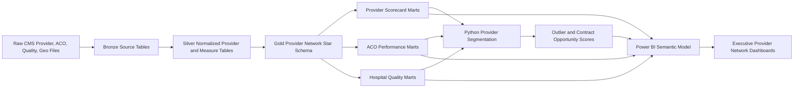

# Provider Network Performance & Value-Based Care Analytics Platform

Single source of truth for building an enterprise-grade provider network, ACO, and value-based care analytics portfolio project.

This project is designed to look like work done by payer provider-network analytics teams, ACO performance teams, population health teams, contracting teams, and value-based care operations groups. It should not look like a generic hospital dashboard. The project must show that you understand provider attribution, cost and quality benchmarking, peer comparison, risk adjustment, geographic variation, network leakage, and shared savings performance.

Target roles:

- Healthcare Data Analyst
- Healthcare Business Analyst
- Provider Network Analyst
- Healthcare BI Analyst
- Population Health Analyst
- Value-Based Care Analyst
- ACO Analytics Analyst
- Payer Contracting Analyst

Project title:

**Provider Network Performance & Value-Based Care Analytics Platform**

Core business question:

**Which providers and ACO-like networks deliver better cost, quality, utilization, and patient outcome performance after accounting for patient risk and regional variation?**

---

## 1. Executive Project Charter

### 1.1 Business problem

Healthcare payers, Medicare Advantage organizations, ACOs, and integrated delivery systems need to manage provider networks under cost and quality pressure. Leadership needs to know which providers are high-performing, which providers create avoidable cost, which regions show inefficient utilization, and which provider groups are strong candidates for value-based contracts.

In real enterprise environments, this requires joining provider identity, claims/utilization, quality measures, readmission measures, geographic benchmarks, and ACO financial performance. This project simulates that environment using public CMS data and builds a decision platform for provider performance, contracting strategy, and value-based care operations.

### 1.2 Business goals

The platform should answer:

- Which providers have high cost per beneficiary compared with peers?
- Which specialties, hospitals, or regions show the largest utilization variation?
- Which hospitals have poor readmission, quality, or patient experience performance?
- Which ACOs generated savings, losses, or quality improvement?
- Which providers are candidates for value-based contracts?
- Which providers require education, network review, or performance intervention?
- Which markets show network adequacy risk or provider saturation?
- Which providers have high procedure intensity, high payment, or unusual service mix?

### 1.3 Primary enterprise users

- VP Provider Network: network strategy, provider performance, contracting priorities
- Value-Based Care Director: shared savings, quality, cost trend, ACO outcomes
- Contracting Analyst: provider rate and utilization comparison
- Population Health Team: high-risk panel and quality opportunity tracking
- Medical Director: readmission, safety, quality, and care variation
- Finance Analytics: cost per beneficiary, avoidable cost, benchmark variance
- BI Team: governed dashboarding and metric definitions

### 1.4 What makes this project professional

The project must include:

- Provider master data model using NPI, facility IDs, specialty, taxonomy, and geography
- Provider peer groups and risk-adjusted benchmarking
- ACO financial and quality performance analysis
- Hospital quality and readmission integration
- Geographic variation and market-level benchmarking
- SQL marts for provider scorecards and contract opportunity ranking
- Python analytics for provider clustering and opportunity segmentation
- ML or statistical model for provider outlier detection
- Power BI dashboards for executive, network, ACO, and provider drill-through use cases
- Clear KPI dictionary and data dictionary
- Documented limitations of public aggregate data

---

## 2. Source Reference Register

Use these links in the README and documentation.

### 2.1 Provider identity and network data

1. **CMS NPPES NPI Files**
   - Link: https://download.cms.gov/nppes/NPI_Files.html
   - Use: National Provider Identifier, provider names, entity type, taxonomy, practice location.
   - Notes: CMS states that issuance of an NPI does not ensure or validate licensure or credentialing. Treat NPI data as provider identity/reference data, not credential verification.

2. **Provider of Services File - Hospital and Non-Hospital Facilities**
   - Link: https://catalog.data.gov/dataset/provider-of-services-file-hospital-non-hospital-facilities
   - Use: Facility characteristics, provider certification details, facility type, Medicare participation.

3. **CMS Provider Data Catalog**
   - Link: https://developer.cms.gov/provider-data/
   - Use: Care Compare provider quality datasets for hospitals, clinicians, nursing homes, home health, hospice, and other provider types.

### 2.2 Provider utilization and payment

4. **CMS Medicare Physician and Other Practitioners by Provider and Service**
   - Link: https://catalog.data.gov/dataset/medicare-physician-other-practitioners-by-provider-and-service
   - Use: NPI, HCPCS, place of service, beneficiary count, service count, submitted charge, allowed amount, Medicare payment.

5. **CMS Medicare Fee-for-Service Parts A and B Reports**
   - Link: https://www.cms.gov/data-research/statistics-trends-and-reports/medicare-fee-for-service-parts-a-b
   - Use: Medicare FFS utilization and payment summaries across care settings.

6. **CMS Medicare Geographic Variation Public Use File**
   - Methods paper: https://www.cms.gov/research-statistics-data-and-systems/statistics-trends-and-reports/medicare-geographic-variation/downloads/geo_var_puf_methods_paper.pdf
   - Use: State/county/regional variation in Medicare spending, utilization, and risk-adjusted metrics.

7. **Medicare Advantage Geographic Variation PUF**
   - Methods paper: https://data.cms.gov/sites/default/files/2022-10/32b7aed5-6ab7-49a4-bbbc-4c668a1bb7f3/MA_GV_PUF_Methods_Final.pdf
   - Use: Optional MA geographic variation context.

### 2.3 Quality and readmission data

8. **CMS Hospital Quality Initiative / Care Compare**
   - Link: https://www.cms.gov/medicare/quality/initiatives/hospital-quality-initiative/hospital-compare
   - Use: Hospital quality measures, patient experience, outcomes, safety, care coordination, ED throughput, star ratings.

9. **CMS Hospital Readmissions Reduction Program**
   - Link: https://www.cms.gov/medicare/payment/prospective-payment-systems/acute-inpatient-pps/hospital-readmissions-reduction-program-hrrp
   - Use: 30-day readmission measure context for AMI, COPD, HF, pneumonia, CABG, and THA/TKA.

10. **CMS Quality Payment Program Public Use Files**
    - Link: https://data.cms.gov/
    - Search term: Quality Payment Program Public Use File
    - Use: Optional clinician-level MIPS and quality performance context.

### 2.4 ACO and value-based care data

11. **Medicare Shared Savings Program Data**
    - Link: https://www.cms.gov/medicare/medicare-fee-for-service-payment/sharedsavingsprogram/acos-in-your-state.html
    - Use: ACO participation, performance, assigned beneficiaries, financial and quality results.

12. **Shared Savings Program Provider Guidance**
    - Link: https://www.cms.gov/medicare/medicare-fee-for-service-payment/sharedsavingsprogram/for-providers
    - Use: ACO program context; CMS describes ACOs as groups of doctors, hospitals, and other providers collaborating to provide coordinated care and share savings if they deliver quality and cost performance.

13. **ACO Financial and Quality Results PUF Methodology**
    - Link: https://data.cms.gov/sites/default/files/2022-08/Performance_Year_Financial_and_Quality_Results_PUF_Methodology.pdf
    - Use: Variables and methodology for ACO financial reconciliation and quality performance.

14. **Publicly Available ACO Data Sources PDF**
    - Link: https://www.cms.gov/files/document/medicare-shared-savings-program-publicly-available-aco-data-and-aco-performance-data-sources.pdf
    - Use: Source map for ACO public files.

### 2.5 Optional socioeconomic and market context

15. **U.S. Census American Community Survey**
    - Link: https://www.census.gov/programs-surveys/acs
    - Use: Market demographics, poverty, age, insurance coverage, social risk.

16. **AHRQ Social Determinants of Health Database**
    - Link: https://www.ahrq.gov/sdoh/data-analytics/sdoh-data.html
    - Use: County-level social determinants and risk context.

---

## 3. Final Dataset Stack

### 3.1 Required core datasets

Use these as the minimum project backbone:

- CMS Physician and Other Practitioners by Provider and Service
- NPPES NPI downloadable file
- CMS Hospital Quality / Care Compare
- CMS Hospital Readmissions Reduction Program data
- CMS Medicare Geographic Variation PUF
- Medicare Shared Savings Program ACO Performance and Participation files

### 3.2 Optional enrichment datasets

Use if you want a more advanced project:

- Provider of Services File for facility certification and facility type
- QPP Public Use File for clinician quality/MIPS context
- ACS or AHRQ SDOH for regional risk context
- CMS SynPUF claims from the claims intelligence project if you want member-level simulated provider attribution

### 3.3 Dataset use matrix

| Business need | Dataset | Project use |
|---|---|---|
| Provider identity | NPPES NPI | Provider master, specialty, taxonomy, address |
| Provider utilization | CMS Physician Provider Service | Service volume, payment, submitted charge, HCPCS mix |
| Hospital quality | Care Compare | Star ratings, quality, patient experience, safety |
| Readmissions | HRRP / Care Compare | Hospital readmission performance |
| Regional benchmarks | Geographic Variation PUF | State/county cost and utilization benchmarks |
| Value-based care | MSSP ACO PUFs | ACO savings, losses, quality, assigned beneficiaries |
| Facility attributes | Provider of Services | Hospital/facility type, certification, ownership |
| Social context | ACS/AHRQ SDOH | Market risk and social determinants |

### 3.4 Datasets to avoid as primary source

Do not build this project around:

- Random hospital appointment no-show datasets
- Single hospital admission CSVs with no provider identity
- Toy generated provider tables
- Chart-only hospital rating datasets without cost/utilization

---

## 4. Business Workflows Simulated

### 4.1 Provider network management

Workflow:

1. Build provider master from NPPES and CMS provider files.
2. Group providers into specialty and peer groups.
3. Join utilization and payment metrics by NPI, specialty, HCPCS, and geography.
4. Compare providers to local, state, and national benchmarks.
5. Identify outliers and network opportunity.

Business output:

- Provider performance scorecard
- Provider contracting opportunity list
- High-cost provider outlier list
- Specialty utilization benchmark dashboard

### 4.2 Value-based care and ACO performance

Workflow:

1. Load ACO participation and performance files.
2. Track assigned beneficiary population.
3. Compare benchmark expenditure, actual expenditure, savings/losses, quality score, and earned shared savings.
4. Identify ACOs with high quality but poor cost, low quality but savings, and balanced performers.
5. Create ACO performance segmentation.

Business output:

- ACO performance dashboard
- Shared savings/loss opportunity analysis
- ACO quality-cost quadrant
- Market expansion recommendation

### 4.3 Hospital quality and readmission performance

Workflow:

1. Load Care Compare and HRRP measures.
2. Build hospital master using CMS certification number and facility attributes.
3. Join readmission, star rating, patient experience, safety, and mortality measures.
4. Compare hospitals by geography and peer group.
5. Identify low-quality or high-readmission facilities for network intervention.

Business output:

- Hospital performance scorecard
- Readmission outlier list
- Facility network quality tiering
- Contracting and steering recommendations

### 4.4 Geographic variation and market analytics

Workflow:

1. Load Medicare Geographic Variation PUF.
2. Compare spending and utilization by state/county/hospital referral region.
3. Join provider density and quality performance where feasible.
4. Identify high-cost markets and low-value markets.

Business output:

- Market opportunity map
- Regional utilization variation report
- Provider saturation and network adequacy screen

---

## 5. End-to-End Pipeline



### 5.1 Layer definitions

Raw:

- Original downloaded CSV, ZIP, or API extracts.
- No column renaming.

Bronze:

- Source-shaped tables.
- Basic data types.
- Add `source_file`, `source_year`, `ingested_at`, `row_hash`.

Silver:

- Standardized provider identifiers.
- Standardized geography.
- Standardized measure names.
- Cleaned numeric fields.
- Provider taxonomy and specialty rollups.

Gold:

- Conformed dimensions and fact tables.
- Provider, facility, geography, date, measure, ACO, and service dimensions.

Marts:

- Provider scorecard
- Hospital quality scorecard
- ACO performance scorecard
- Market opportunity
- Contracting opportunity
- Provider outlier queue

ML/scoring:

- Provider clustering
- Outlier detection
- Contract opportunity scoring
- ACO performance segmentation

Power BI:

- Executive dashboards and drill-through scorecards.

---

## 6. Repository Structure

```text
provider-network-value-based-care-analytics/
  README.md
  requirements.txt
  .gitignore

  docs/
    Provider_Network_Value_Based_Care_Analytics_Blueprint.md
    business_problem.md
    data_sources.md
    architecture.md
    data_dictionary.md
    kpi_dictionary.md
    provider_scorecard_methodology.md
    aco_performance_methodology.md
    dashboard_spec.md
    executive_summary.md
    portfolio_case_study.md
    interview_talking_points.md

  data/
    raw/
      nppes/
      provider_utilization/
      care_compare/
      hrrp/
      geographic_variation/
      mssp_aco/
      provider_of_services/
      sdoh_optional/
    interim/
    processed/

  sql/
    00_admin/
    01_bronze_ddl/
    02_silver_transforms/
    03_gold_star_schema/
    04_marts/
    05_quality_tests/
    06_analytics_queries/

  src/
    etl/
    features/
    scoring/
    reporting/

  notebooks/
    01_provider_source_profile.ipynb
    02_provider_utilization_eda.ipynb
    03_hospital_quality_eda.ipynb
    04_aco_performance_eda.ipynb
    05_provider_outlier_detection.ipynb
    06_market_opportunity_analysis.ipynb

  powerbi/
    provider_network_vbc_platform.pbip/
    exports/

  reports/
    figures/
    executive_summary.pdf
```

---

## 7. Data Architecture

### 7.1 Schemas

Use:

- `raw`
- `bronze`
- `silver`
- `gold`
- `mart`
- `score`
- `dq`

### 7.2 Gold dimensions

#### dim_provider

Grain: one row per NPI or provider identifier.

Columns:

- `provider_key`
- `npi`
- `entity_type`
- `provider_name`
- `organization_name`
- `first_name`
- `last_name`
- `primary_taxonomy_code`
- `primary_taxonomy_description`
- `specialty_group`
- `provider_type`
- `practice_address_line_1`
- `practice_city`
- `practice_state`
- `practice_zip`
- `county_fips`
- `is_individual`
- `is_organization`
- `npi_deactivation_date`
- `source_system`

Specialty group examples:

- Primary care
- Cardiology
- Orthopedics
- Emergency medicine
- Radiology
- Oncology
- Behavioral health
- Surgery
- Facility
- DME/supplier
- Other

#### dim_facility

Grain: one row per hospital/facility certification number.

Columns:

- `facility_key`
- `ccn`
- `facility_name`
- `facility_type`
- `ownership_type`
- `address`
- `city`
- `state`
- `zip`
- `county_name`
- `county_fips`
- `hospital_referral_region`
- `urban_rural_flag`
- `beds`
- `emergency_services_flag`
- `medicare_certification_date`

#### dim_geography

Grain: one row per geography level and code.

Columns:

- `geo_key`
- `geo_level`
- `state_code`
- `state_name`
- `county_fips`
- `county_name`
- `cbsa`
- `hrr`
- `region`
- `poverty_rate`
- `median_income`
- `dual_eligible_proxy`
- `sdoh_risk_index`

#### dim_service

Grain: one row per HCPCS/service code.

Columns:

- `service_key`
- `hcpcs_code`
- `hcpcs_description`
- `service_category`
- `place_of_service`
- `clinical_category`
- `is_evaluation_management`
- `is_imaging`
- `is_procedure`
- `is_dme`

#### dim_aco

Grain: one row per ACO per performance year if ACO IDs change over time.

Columns:

- `aco_key`
- `aco_id`
- `aco_name`
- `performance_year`
- `agreement_period`
- `track`
- `risk_model`
- `start_date`
- `state`
- `assigned_beneficiaries`
- `low_revenue_flag`
- `advance_investment_payment_flag`

#### dim_measure

Grain: one row per quality or performance measure.

Columns:

- `measure_key`
- `measure_id`
- `measure_name`
- `measure_domain`
- `measure_type`
- `higher_is_better_flag`
- `unit`
- `source_program`

Measure domains:

- Cost
- Quality
- Readmission
- Mortality
- Patient experience
- Safety
- Utilization
- Access
- ACO financial

### 7.3 Gold facts

#### fact_provider_service_utilization

Grain: provider, service, place of service, year.

Columns:

- `provider_key`
- `service_key`
- `geo_key`
- `year`
- `place_of_service`
- `beneficiary_count`
- `service_count`
- `submitted_charge_amount`
- `allowed_amount`
- `medicare_payment_amount`
- `payment_per_service`
- `payment_per_beneficiary`

#### fact_provider_year

Grain: provider-year.

Columns:

- `provider_key`
- `year`
- `specialty_group`
- `beneficiary_count`
- `service_count`
- `total_payment`
- `total_allowed`
- `total_submitted`
- `payment_per_beneficiary`
- `services_per_beneficiary`
- `procedure_mix_index`
- `service_concentration_index`
- `peer_cost_percentile`
- `peer_utilization_percentile`

#### fact_hospital_quality

Grain: facility, measure, reporting period.

Columns:

- `facility_key`
- `measure_key`
- `reporting_period`
- `score`
- `national_benchmark`
- `state_benchmark`
- `better_than_national_flag`
- `worse_than_national_flag`

#### fact_aco_performance

Grain: ACO performance year.

Columns:

- `aco_key`
- `performance_year`
- `assigned_beneficiaries`
- `benchmark_expenditure`
- `actual_expenditure`
- `gross_savings_losses`
- `earned_shared_savings`
- `quality_score`
- `minimum_savings_rate`
- `savings_rate`
- `loss_rate`
- `shared_savings_flag`
- `shared_losses_flag`

#### fact_geo_variation

Grain: geography, year, measure.

Columns:

- `geo_key`
- `year`
- `measure_key`
- `beneficiary_count`
- `per_capita_cost`
- `risk_score`
- `admissions_per_1000`
- `ed_visits_per_1000`
- `readmissions_per_1000`
- `standardized_payment`

#### fact_provider_score

Grain: provider-year-score version.

Columns:

- `provider_key`
- `year`
- `cost_score`
- `utilization_score`
- `quality_proxy_score`
- `risk_context_score`
- `network_value_score`
- `outlier_flag`
- `contracting_opportunity_tier`
- `recommended_action`

---

## 8. SQL Build Plan

### 8.1 SQL files to create

```text
sql/
  00_admin/
    create_schemas.sql
  01_bronze_ddl/
    bronze_nppes.sql
    bronze_provider_utilization.sql
    bronze_care_compare.sql
    bronze_hrrp.sql
    bronze_geo_variation.sql
    bronze_aco_performance.sql
  02_silver_transforms/
    silver_provider_master.sql
    silver_facility_master.sql
    silver_provider_services.sql
    silver_hospital_measures.sql
    silver_aco_performance.sql
    silver_geo_benchmarks.sql
  03_gold_star_schema/
    dim_provider.sql
    dim_facility.sql
    dim_geography.sql
    dim_service.sql
    dim_aco.sql
    dim_measure.sql
    fact_provider_service_utilization.sql
    fact_provider_year.sql
    fact_hospital_quality.sql
    fact_aco_performance.sql
    fact_geo_variation.sql
  04_marts/
    mart_provider_scorecard.sql
    mart_provider_peer_benchmark.sql
    mart_hospital_quality_scorecard.sql
    mart_aco_performance.sql
    mart_market_opportunity.sql
    mart_contracting_opportunity.sql
    mart_provider_outlier_queue.sql
```

### 8.2 Provider peer benchmark mart

Output: `mart.mart_provider_peer_benchmark`

Required fields:

- `provider_key`
- `npi`
- `provider_name`
- `specialty_group`
- `state`
- `year`
- `beneficiary_count`
- `service_count`
- `total_payment`
- `payment_per_beneficiary`
- `services_per_beneficiary`
- `peer_median_payment_per_beneficiary`
- `peer_median_services_per_beneficiary`
- `cost_percentile`
- `utilization_percentile`
- `provider_tier`

SQL:

```sql
WITH provider_year AS (
    SELECT
        p.provider_key,
        p.npi,
        p.provider_name,
        p.specialty_group,
        g.state_code,
        f.year,
        SUM(f.beneficiary_count) AS beneficiary_count,
        SUM(f.service_count) AS service_count,
        SUM(f.medicare_payment_amount) AS total_payment,
        SUM(f.medicare_payment_amount) * 1.0 / NULLIF(SUM(f.beneficiary_count), 0) AS payment_per_beneficiary,
        SUM(f.service_count) * 1.0 / NULLIF(SUM(f.beneficiary_count), 0) AS services_per_beneficiary
    FROM gold.fact_provider_service_utilization f
    JOIN gold.dim_provider p
        ON f.provider_key = p.provider_key
    JOIN gold.dim_geography g
        ON f.geo_key = g.geo_key
    GROUP BY
        p.provider_key, p.npi, p.provider_name, p.specialty_group, g.state_code, f.year
),
benchmarks AS (
    SELECT
        *,
        PERCENTILE_CONT(0.5) WITHIN GROUP (ORDER BY payment_per_beneficiary)
            OVER (PARTITION BY specialty_group, state_code, year) AS peer_median_payment_per_beneficiary,
        PERCENTILE_CONT(0.5) WITHIN GROUP (ORDER BY services_per_beneficiary)
            OVER (PARTITION BY specialty_group, state_code, year) AS peer_median_services_per_beneficiary,
        PERCENT_RANK() OVER (
            PARTITION BY specialty_group, state_code, year
            ORDER BY payment_per_beneficiary
        ) AS cost_percentile,
        PERCENT_RANK() OVER (
            PARTITION BY specialty_group, state_code, year
            ORDER BY services_per_beneficiary
        ) AS utilization_percentile
    FROM provider_year
)
SELECT
    *,
    CASE
        WHEN cost_percentile >= 0.90 AND utilization_percentile >= 0.90 THEN 'High-cost high-utilization outlier'
        WHEN cost_percentile >= 0.90 THEN 'High-cost outlier'
        WHEN utilization_percentile >= 0.90 THEN 'High-utilization outlier'
        WHEN cost_percentile <= 0.50 AND utilization_percentile <= 0.50 THEN 'Efficient peer performer'
        ELSE 'Expected range'
    END AS provider_tier
FROM benchmarks;
```

If your database does not support `PERCENTILE_CONT`, replace with approximate percentiles or precomputed Python benchmarks.

### 8.3 ACO performance mart

Output: `mart.mart_aco_performance`

Required fields:

- `aco_key`
- `aco_name`
- `performance_year`
- `assigned_beneficiaries`
- `benchmark_expenditure`
- `actual_expenditure`
- `gross_savings_losses`
- `earned_shared_savings`
- `savings_rate`
- `quality_score`
- `quality_cost_quadrant`
- `aco_performance_tier`

SQL:

```sql
SELECT
    a.aco_key,
    a.aco_name,
    f.performance_year,
    f.assigned_beneficiaries,
    f.benchmark_expenditure,
    f.actual_expenditure,
    f.gross_savings_losses,
    f.earned_shared_savings,
    f.gross_savings_losses * 1.0 / NULLIF(f.benchmark_expenditure, 0) AS savings_rate,
    f.quality_score,
    CASE
        WHEN f.gross_savings_losses > 0 AND f.quality_score >= 90 THEN 'High quality savings'
        WHEN f.gross_savings_losses > 0 AND f.quality_score < 90 THEN 'Savings but quality risk'
        WHEN f.gross_savings_losses <= 0 AND f.quality_score >= 90 THEN 'High quality cost opportunity'
        ELSE 'Underperforming'
    END AS quality_cost_quadrant,
    CASE
        WHEN f.earned_shared_savings > 0 AND f.quality_score >= 90 THEN 'Preferred VBC partner'
        WHEN f.gross_savings_losses > 0 THEN 'Savings candidate'
        WHEN f.quality_score >= 90 THEN 'Quality partner needing cost support'
        ELSE 'Performance improvement required'
    END AS aco_performance_tier
FROM gold.fact_aco_performance f
JOIN gold.dim_aco a
    ON f.aco_key = a.aco_key;
```

### 8.4 Hospital quality scorecard mart

Output: `mart.mart_hospital_quality_scorecard`

Required fields:

- `facility_key`
- `facility_name`
- `state`
- `overall_star_rating`
- `readmission_score`
- `mortality_score`
- `patient_experience_score`
- `safety_score`
- `quality_composite_score`
- `quality_tier`
- `network_action`

SQL pattern:

```sql
WITH measure_pivot AS (
    SELECT
        facility_key,
        MAX(CASE WHEN measure_domain = 'Star Rating' THEN score END) AS overall_star_rating,
        AVG(CASE WHEN measure_domain = 'Readmission' THEN score END) AS readmission_score,
        AVG(CASE WHEN measure_domain = 'Mortality' THEN score END) AS mortality_score,
        AVG(CASE WHEN measure_domain = 'Patient Experience' THEN score END) AS patient_experience_score,
        AVG(CASE WHEN measure_domain = 'Safety' THEN score END) AS safety_score
    FROM gold.fact_hospital_quality f
    JOIN gold.dim_measure m
        ON f.measure_key = m.measure_key
    GROUP BY facility_key
),
scored AS (
    SELECT
        facility_key,
        overall_star_rating,
        readmission_score,
        mortality_score,
        patient_experience_score,
        safety_score,
        (
            0.30 * COALESCE(overall_star_rating, 0)
            + 0.25 * COALESCE(readmission_score, 0)
            + 0.20 * COALESCE(mortality_score, 0)
            + 0.15 * COALESCE(patient_experience_score, 0)
            + 0.10 * COALESCE(safety_score, 0)
        ) AS quality_composite_score
    FROM measure_pivot
)
SELECT
    f.facility_key,
    f.facility_name,
    f.state,
    s.*,
    CASE
        WHEN quality_composite_score >= 4 THEN 'Preferred facility'
        WHEN quality_composite_score >= 3 THEN 'Standard facility'
        WHEN quality_composite_score >= 2 THEN 'Watchlist'
        ELSE 'Network quality intervention'
    END AS quality_tier,
    CASE
        WHEN quality_composite_score < 2 THEN 'Review contract and quality improvement plan'
        WHEN quality_composite_score < 3 THEN 'Monitor with provider relations'
        ELSE 'Maintain'
    END AS network_action
FROM scored s
JOIN gold.dim_facility f
    ON s.facility_key = f.facility_key;
```

### 8.5 Contracting opportunity mart

Output: `mart.mart_contracting_opportunity`

Logic:

- Efficient provider: low cost percentile and acceptable quality.
- Strategic provider: high volume and acceptable quality.
- Improvement target: high cost and high utilization.
- Contract risk: poor quality and high cost.

Required fields:

- `provider_or_facility_key`
- `entity_type`
- `name`
- `market`
- `volume_score`
- `cost_score`
- `quality_score`
- `network_value_score`
- `opportunity_tier`
- `recommended_contract_action`

Recommended action values:

- Preferred value-based contract candidate
- Negotiate performance guarantee
- Provider education and utilization review
- Quality improvement plan
- Monitor only
- Do not prioritize

---

## 9. Python Analytics Plan

### 9.1 EDA notebooks

#### `01_provider_source_profile.ipynb`

Outputs:

- Row counts by source
- NPI completeness
- Specialty distribution
- State distribution
- Missing payment metrics
- Provider utilization date coverage
- Duplicates and malformed identifiers

#### `02_provider_utilization_eda.ipynb`

Outputs:

- Payment distribution by specialty
- Services per beneficiary by specialty
- Top HCPCS by payment
- Provider concentration by market
- High-cost provider outliers
- Specialty-level peer benchmarks

#### `03_hospital_quality_eda.ipynb`

Outputs:

- Star rating distribution
- Readmission measure variation
- Patient experience variation
- Quality by ownership/facility type
- High-cost/high-quality and high-cost/low-quality quadrant

#### `04_aco_performance_eda.ipynb`

Outputs:

- ACO savings/loss distribution
- Quality score distribution
- Shared savings by assigned beneficiaries
- ACO performance quadrant
- Risk model or track comparison

#### `05_provider_outlier_detection.ipynb`

Outputs:

- Provider outlier feature table
- Isolation Forest or robust z-score outliers
- Cluster profiles
- Provider action tiers

#### `06_market_opportunity_analysis.ipynb`

Outputs:

- Market cost variation
- Provider density
- High-cost regions
- Quality gaps by region
- Network expansion/contracting opportunities

### 9.2 Feature engineering

Provider features:

- `payment_per_beneficiary`
- `services_per_beneficiary`
- `payment_per_service`
- `service_mix_entropy`
- `top_hcpcs_payment_share`
- `evaluation_management_share`
- `imaging_share`
- `procedure_share`
- `dme_share`
- `peer_cost_percentile`
- `peer_utilization_percentile`
- `state_cost_index`
- `provider_volume_tier`

Facility features:

- `overall_star_rating`
- `readmission_score`
- `mortality_score`
- `patient_experience_score`
- `safety_score`
- `quality_composite_score`
- `facility_volume_proxy`
- `market_quality_percentile`

ACO features:

- `assigned_beneficiaries`
- `benchmark_expenditure`
- `actual_expenditure`
- `gross_savings_losses`
- `savings_rate`
- `earned_shared_savings`
- `quality_score`
- `beneficiaries_per_participant`
- `performance_tier`

Market features:

- `per_capita_cost`
- `risk_score`
- `admissions_per_1000`
- `ed_visits_per_1000`
- `provider_density`
- `quality_gap_index`
- `sdoh_risk_index`

---

## 10. ML and Statistical Scoring Design

### 10.1 Provider outlier detection

Purpose:

- Identify providers whose utilization or payment patterns deviate from peers.

Prediction unit:

- Provider-year.

Input table:

- `score.feature_provider_year`

Methods:

- Robust z-score by specialty and state
- Isolation Forest
- Local Outlier Factor
- K-means clustering for provider profiles

Evaluation:

- Outlier concentration in top percentile
- Business review of top 50 providers
- Stability by year
- Specialty-specific explainability

Output:

- `provider_key`
- `outlier_score`
- `outlier_percentile`
- `top_outlier_driver`
- `recommended_action`

### 10.2 Contracting opportunity score

Purpose:

- Rank providers for value-based contracting or network strategy.

Scoring formula:

```text
network_value_score =
    0.30 * volume_score
  + 0.25 * quality_score
  + 0.20 * cost_efficiency_score
  + 0.15 * market_need_score
  + 0.10 * stability_score
```

Score components:

- Volume score: beneficiary/service volume percentile
- Quality score: quality composite or proxy
- Cost efficiency score: inverse cost percentile
- Market need score: provider scarcity or high-cost market opportunity
- Stability score: year-over-year consistency

Output tiers:

- Tier 1: Preferred VBC contract candidate
- Tier 2: Strategic network partner
- Tier 3: Improvement opportunity
- Tier 4: Monitor
- Tier 5: Contract risk

### 10.3 ACO performance segmentation

Purpose:

- Group ACOs into business-relevant performance segments.

Inputs:

- Savings rate
- Quality score
- Assigned beneficiaries
- Earned shared savings
- Benchmark vs actual expenditure

Segments:

- High quality savings performer
- High quality cost opportunity
- Savings with quality concern
- Underperforming ACO
- Small ACO with unstable results

---

## 11. Power BI Dashboard Specification

### 11.1 Pages

#### Page 1: Executive Provider Network Overview

KPI cards:

- Total providers
- Total Medicare payment
- Providers above 90th cost percentile
- Preferred provider candidates
- Contract risk providers
- Average network value score
- ACO shared savings
- Average hospital star rating

Visuals:

- Provider performance quadrant
- Payment by specialty
- Outlier providers by peer group
- Market opportunity map
- ACO quality-cost quadrant
- Hospital quality tier distribution

#### Page 2: Provider Peer Benchmarking

KPI cards:

- Selected provider payment per beneficiary
- Peer median payment per beneficiary
- Services per beneficiary
- Cost percentile
- Utilization percentile

Visuals:

- Provider vs peer benchmark bars
- Specialty scatter: cost percentile vs utilization percentile
- Top HCPCS/services
- Service mix treemap
- Provider drill-through table

#### Page 3: Hospital Quality and Readmissions

KPI cards:

- Average star rating
- Readmission outlier count
- Preferred facilities
- Quality intervention facilities

Visuals:

- Hospital quality scorecard
- Readmission performance by state
- Star rating distribution
- Quality vs cost quadrant
- Facility drill-through

#### Page 4: ACO Performance

KPI cards:

- Assigned beneficiaries
- Total gross savings/losses
- Earned shared savings
- Average quality score
- ACOs with shared savings

Visuals:

- ACO savings trend
- Quality vs savings scatter
- ACO performance tier table
- Savings rate distribution
- ACO drill-through profile

#### Page 5: Market Opportunity

KPI cards:

- High-cost markets
- Low-quality markets
- Provider density
- Market opportunity score

Visuals:

- Map by market opportunity
- Per-capita cost by geography
- Provider density vs cost
- Market quality gap
- Recommended market actions

#### Page 6: Contracting Opportunity

KPI cards:

- VBC candidates
- Strategic partners
- Improvement targets
- Contract risks

Visuals:

- Contract opportunity ranked list
- Network value score distribution
- Recommended action matrix
- Provider/facility drill-through

#### Page 7: Data Quality and Governance

Visuals:

- Source row counts
- NPI match rate
- Facility match rate
- Missing quality score rate
- Measure coverage by source
- Last refresh date

### 11.2 Core DAX measures

```DAX
Total Medicare Payment =
SUM(fact_provider_service_utilization[medicare_payment_amount])

Total Services =
SUM(fact_provider_service_utilization[service_count])

Total Beneficiaries =
SUM(fact_provider_service_utilization[beneficiary_count])

Payment Per Beneficiary =
DIVIDE([Total Medicare Payment], [Total Beneficiaries])

Services Per Beneficiary =
DIVIDE([Total Services], [Total Beneficiaries])

Outlier Providers =
CALCULATE(
    DISTINCTCOUNT(mart_provider_peer_benchmark[provider_key]),
    mart_provider_peer_benchmark[cost_percentile] >= 0.90
)

Average Quality Score =
AVERAGE(mart_hospital_quality_scorecard[quality_composite_score])

ACO Gross Savings =
SUM(mart_aco_performance[gross_savings_losses])

ACO Earned Shared Savings =
SUM(mart_aco_performance[earned_shared_savings])

Preferred VBC Candidates =
CALCULATE(
    DISTINCTCOUNT(mart_contracting_opportunity[provider_or_facility_key]),
    mart_contracting_opportunity[opportunity_tier] = "Preferred value-based contract candidate"
)
```

---

## 12. KPI Dictionary

| KPI | Formula | Grain | Business owner |
|---|---|---|---|
| Total Medicare payment | Sum Medicare payment amount | Provider-service-year | Finance/network |
| Payment per beneficiary | Total payment / beneficiary count | Provider-year | Provider network |
| Services per beneficiary | Service count / beneficiary count | Provider-year | Utilization |
| Payment per service | Total payment / service count | Provider-service | Contracting |
| Cost percentile | Provider payment per beneficiary percentile within specialty/state/year | Provider-year | Network |
| Utilization percentile | Provider services per beneficiary percentile within specialty/state/year | Provider-year | Network |
| Provider outlier count | Providers with cost or utilization percentile above threshold | Provider-year | Network |
| Quality composite score | Weighted hospital quality domain score | Facility | Quality |
| Readmission outlier | Facility worse than benchmark on readmission measures | Facility | Quality/UM |
| ACO savings rate | Gross savings/losses / benchmark expenditure | ACO-year | VBC |
| Earned shared savings | CMS reported shared savings amount | ACO-year | VBC/finance |
| ACO quality score | CMS reported quality score | ACO-year | VBC |
| Network value score | Weighted score across volume, quality, efficiency, market need, stability | Provider/facility | Contracting |
| Market opportunity score | Weighted high cost, low quality, low provider density, high need | Geography | Strategy |

---

## 13. Data Quality Rules

Required checks:

- NPI is valid length and numeric when applicable.
- Provider rows deduplicated by NPI.
- Provider taxonomy mapped to specialty group.
- Payment amounts are non-negative unless adjustment logic exists.
- Beneficiary counts and service counts are positive.
- Facility IDs match Care Compare where possible.
- Measure IDs map to measure dimension.
- ACO performance year is valid.
- ACO assigned beneficiaries are positive.
- Geographic identifiers are standardized.
- No provider-year duplicates in final scorecard.

Quality outputs:

- NPI match rate
- Facility match rate
- Missing specialty rate
- Missing quality measure rate
- Payment reconciliation by source
- Row count reconciliation from bronze to gold

---

## 14. Business Insights To Generate

Minimum final insights:

1. Top provider specialties driving Medicare payment.
2. Providers above 90th percentile for cost and utilization within peer group.
3. Provider groups with efficient cost and high volume.
4. Hospitals with low quality or high readmission risk.
5. ACOs that achieved savings with strong quality.
6. ACOs with high quality but cost opportunity.
7. Markets with high per-capita cost and provider performance gaps.
8. Recommended providers for value-based contracting.
9. Recommended facilities for quality intervention.
10. Network strategy recommendations by market.

---

## 15. Implementation Roadmap

### Phase 1: Data acquisition

Tasks:

- Download NPPES NPI file.
- Download CMS Physician Provider Utilization by Provider and Service.
- Download Care Compare hospital quality files.
- Download HRRP/readmission data.
- Download Medicare Geographic Variation PUF.
- Download MSSP ACO performance and participation files.
- Optional: download POS, QPP, ACS, AHRQ SDOH.

Deliverable:

- `docs/data_sources.md` with source links, file names, years, limitations.

### Phase 2: Provider master and normalization

Tasks:

- Build NPI provider master.
- Map taxonomy to specialty group.
- Build facility master from POS/Care Compare.
- Standardize geography.

Deliverable:

- `gold.dim_provider`
- `gold.dim_facility`
- `gold.dim_geography`

### Phase 3: Utilization and quality facts

Tasks:

- Build provider service utilization fact.
- Build provider-year aggregate fact.
- Build hospital quality fact.
- Build ACO performance fact.
- Build geographic variation fact.

Deliverable:

- Gold star schema ready for marts.

### Phase 4: SQL marts

Tasks:

- Provider peer benchmark mart.
- Hospital quality scorecard mart.
- ACO performance mart.
- Market opportunity mart.
- Contracting opportunity mart.
- Provider outlier queue.

Deliverable:

- Reusable governed analytics tables.

### Phase 5: Python scoring

Tasks:

- Profile provider utilization.
- Build provider features.
- Run provider outlier detection.
- Score contracting opportunity.
- Segment ACO performance.
- Export scores to database.

Deliverable:

- `score.provider_outlier_scores`
- `score.contracting_opportunity_scores`
- Notebook figures.

### Phase 6: Power BI dashboards

Tasks:

- Build semantic model from marts.
- Create executive page.
- Create provider benchmarking page.
- Create hospital quality page.
- Create ACO page.
- Create market opportunity page.
- Create contracting page.
- Create data quality page.

Deliverable:

- Power BI report and exported screenshots.

### Phase 7: Portfolio packaging

Tasks:

- Write README.
- Write case study.
- Write KPI dictionary.
- Write architecture explanation.
- Write interview talking points.

Deliverable:

- Portfolio-ready GitHub repository.

---

## 16. README Outline

```text
# Provider Network Performance & Value-Based Care Analytics Platform

## Executive Summary
## Business Problem
## Data Sources
## Architecture
## Data Model
## Provider Scorecard Methodology
## ACO Performance Methodology
## SQL Marts
## Python Scoring
## Power BI Dashboard
## Key Insights
## Limitations
## How To Run
## Interview Talking Points
```

---

## 17. Interview Talking Points

### 60-second pitch

"I built a provider network and value-based care analytics platform using CMS provider utilization, NPPES, Care Compare, HRRP, Geographic Variation, and Medicare Shared Savings Program data. The platform creates provider peer benchmarks, hospital quality scorecards, ACO performance segmentation, market opportunity analysis, and contracting opportunity scores. It simulates how payer network teams evaluate providers for cost efficiency, quality, utilization, and value-based care readiness."

### SQL talking points

- Built provider/facility/ACO/geography dimensions.
- Joined NPI provider identity to provider-service utilization.
- Created provider peer groups by specialty and geography.
- Used percentiles and window functions for provider ranking.
- Built ACO quality-cost quadrant and hospital quality scorecards.

### Business talking points

- Provider performance requires peer comparison, not raw ranking.
- Cost metrics need specialty and geography context.
- High quality with high cost is different from low quality with high cost.
- ACO performance should balance savings and quality.
- Contracting decisions need volume, quality, cost efficiency, and market need.

### Resume bullets

- Built a CMS-based provider network analytics warehouse integrating NPPES, provider utilization, Care Compare, HRRP, Geographic Variation, and ACO performance data.
- Developed SQL marts for provider peer benchmarking, hospital quality scorecards, ACO quality-cost segmentation, market opportunity, and contracting recommendations.
- Created provider outlier and value-based contracting opportunity scores using peer percentiles, utilization metrics, quality composites, and market context.
- Designed Power BI dashboards for provider network performance, value-based care, ACO outcomes, hospital quality, and market strategy.

---

## 18. Final Acceptance Checklist

- Data sources downloaded and documented.
- Provider master created.
- Facility master created.
- Provider utilization fact created.
- Hospital quality fact created.
- ACO performance fact created.
- Geographic variation fact created.
- Provider benchmark mart built.
- Hospital quality scorecard built.
- ACO performance mart built.
- Market opportunity mart built.
- Contracting opportunity mart built.
- Provider outlier scoring complete.
- Power BI dashboard complete.
- KPI dictionary complete.
- Case study complete.
- Interview talking points complete.

Final positioning:

**An enterprise provider-network analytics platform that uses public CMS datasets to benchmark provider cost, utilization, quality, ACO performance, and market opportunity for value-based care and contracting strategy.**

